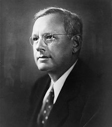
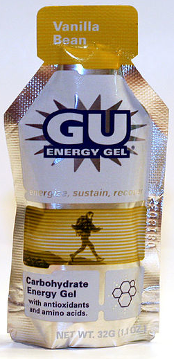
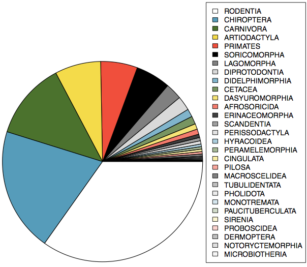

<style>
citation {
  font-size: 4px;
}
</style>

<!--  Version 1.0-0

      This version of the slides is taken directly from Mine Çetinkaya-Rundel's lecture slides
      posted on OpenIntro.org in .pptx and .gdslides format, and moved to Rmd. Originally done
      as a translation for github.com/wesleyburr/introstat_random/.
      
      A large part of the HTML/CSS formatting is janky, and could be cleaned up. Feel free to issue a 
      pull request if you love HTML and CSS and want to fix this up.
      
      - wburr, Sept 3, 2018
-->

<!-- Chapter 1.1 -->
# Case Study: Treating Chronic Fatigue Syndrome

## Treating Chronic Fatigue Syndrome

**Objective**. Evaluate the effectiveness of cognitive-behavior therapy for chronic fatigue syndrome.

**Participant pool**. 142 patients who were recruited from referrals by primary care physicians and consultants to a hospital clinic specializing in chronic fatigue syndrome.

**Actual participants**. Only 60 of the 142 referred patients entered the study. Some were excluded because they didn't meet the diagnostic criteria, some had other health issues, and some refused to be a part of the study.

<div id="footnote">Study from: Deale, et. al. 1997. *Cognitive behavior therapy for chronic fatigue syndrome: A randomized controlled trial*. The American Journal of Psychiatry 154:3.</div>


## Study Design

Patients randomly assigned to treatment and control groups, 30 patients in each group:

**Treatment**: Cognitive behavior therapy $-$ collaborative, educative, and with a behavioral emphasis. Patients were shown on how activity could be increased steadily and safely without exacerbating symptoms.

**Control**: Relaxation $-$ No advice was given about how activity could be increased. Instead progressive muscle relaxation, visualization, and rapid relaxation skills were taught.

## Results

The table below shows the distribution of patients with good outcomes at 6-month follow-up. Note that 7 patients dropped out of the study: 3 from the treatment and 4 from the control group.

<!-- using the kableExtra package here to make a nice looking table -->
**Proportion with good outcomes**
```{r, makeOutcomeTable1_1, echo = FALSE}
library("kableExtra")
library("knitr")
options(knitr.table.format = "html") 
dt <- data.frame("Yes" = c(19, 5, 24), "No" = c(8, 21, 29), "Total" = c(27, 26, 53))
row.names(dt) <- c("Treatment", "Control", "")
kable(dt, align = 'ccc') %>%
  kable_styling("striped", full_width = FALSE, position = "center", font_size = 20) %>%
  add_header_above(c(" " = 1, "Good outcome" = 2, " " = 1)) %>%
  group_rows("Groups", 1, 2) %>%
  group_rows("Total", 3, 3)
```

<br />
Treatment Group: 19/27 = 0.70 = 70%

Control Group: 5/26 = 0.19 = 19%

## Understanding the results

**Do the data show a "real" difference between the groups?**

Suppose you flip a coin 100 times. While the chance a coin lands heads in any given coin flip is 50%, we probably won't observe exactly 50 heads. This type of fluctuation is part of almost any type of data generating process.

The observed difference between the two groups (70 - 19 = 51%) may be real, or may be due to natural variation.

Since the difference is quite large, it is more believable that the difference is real.

We use statistical tools to determine if the difference is so large that we should reject the notion that it was due to chance.

## Generalizing the results

**Are the results of this study generalizable to all patients with chronic fatigue syndrome?**

No. These patients had specific characteristics and volunteered to be a part of this study, therefore they may not be representative of all patients with chronic fatigue syndrome.

While we cannot immediately generalize the results to all patients, this first study is encouraging. The method at least works for patients with some narrow set of characteristics, and that gives hope that it will work, at least to some degree, with other patients.

<!-- Chapter 1.2 -->
# Data Basics

## Data matrix

Data collected on students in a statistics class on a variety of variables

```{r, out.width = "750px", echo = FALSE}

```

## Types of variables

```{r, out.width = "750px", echo = FALSE}
knitr::include_graphics("fig/fig_1_2_classify.png")
```

## Types of variables (cont.)

```{r, out.width = "650px", echo = FALSE}

```

* **gender** $-$ categorical
* **sleep** $-$ numerical, continuous
* **bedtime** $-$ categorical, ordinal
* **countries** $-$ numerical, discrete
* **dread** $-$ categorical, ordinal (could also be used as numerical)

## Practice

What type of variable is a telephone area code?

1. numerical, continuous
2. numerical, discrete
3. categorical
4. categorical, ordinal

## Practice

What type of variable is a telephone area code?

1. numerical, continuous
2. numerical, discrete
3. <span id="highlight">categorical</span>
4. categorical, ordinal

## Relationships between variables

Does there appear to be a relationship between the hours of study per week and the GPA of a student?

```{r, out.width = "500px", echo = FALSE}

```

**Can you spot anything unusual about any of the data points?**

## Practice

Based on the scatterplot, which of the following statements is correct about the head and skull length of possums? 

<div style= "float:right;position: relative; top: -20px;">
```{r, echo=FALSE, out.width = "350px"}

```
</div>


1. There is no relationship between head length and skull width,
i.e. the variables are independent.
2. Head length and skull width are positively associated.
3. Skull width and head length are negatively associated.
4. A longer head causes the skull to be wider.
5. A wider skull causes the head to be longer.

## Practice

Based on the scatterplot, which of the following statements is correct about the head and skull length of possums? 

<div style= "float:right;position: relative; top: -20px;">
```{r, echo=FALSE, out.width = "350px"}

```
</div>


1. There is no relationship between head length and skull width,
i.e. the variables are independent.
2. <span id="highlight">Head length and skull width are positively associated.</span>
3. Skull width and head length are negatively associated.
4. A longer head causes the skull to be wider.
5. A wider skull causes the head to be longer.

## Associated versus Independent

* When two variables show some connection with one another, they are called **associated variables**.
  * Associated variables can also be called **dependent variables**, and vice-versa
* If two variables are not associated, i.e., there is no evident connection between the two, then they are said to be **independent**.

<!-- Chapter 1.3 -->
# Overview of Data Collection Principles

## Populations and Samples

<div style= "float:right;position: relative; top: -20px;">
```{r, echo=FALSE, out.width = "350px"}
knitr::include_graphics("fig/fig_1_3_running.png")
```
</div>

**Research Question** 
Can people become better, more efficient runners on their own, merely by running?

**Population of Interest**
All people

**Sample**
Group of adult women who recently joined a running group

**Population to which results can be generalized**
Adult women, if the data are randomly sampled

<div id="footnote">Image source: http://well.blogs.nytimes.com/2012/08/29/finding-your-ideal-running-form</div>

## Anecdotal evidence and early smoking research

* Anti-smoking research started in the 1930s and 1940s when cigarette smoking became increasingly popular. While some smokers seemed to be sensitive to cigarette smoke, others were completely unaffected.
* Anti-smoking research was faced with resistance based on **anecdotal evidence** such as "My uncle smokes three packs a day and he's in perfectly good health", evidence based on a limited sample size that might not be representative of the population.
* It was concluded that "smoking is a complex human behavior, by its nature difficult to study, confounded by human variability."
* In time researchers were able to examine larger samples of cases (smokers), and trends showing that smoking has negative health impacts became much clearer.

<div id="footnote">Brandt, The Cigarette Century (2009), Basic Books.</div>

## Census

* Wouldn't it be better to just include everyone and "sample" the entire population?
  * This is called a **census**
* There are problems with taking a census:
  * It can be difficult to complete a census: there always seem to be some individuals who are hard to locate or hard to measure. And these difficult-to-find people may have certain characteristics that distinguish them from the rest of the population.
  * Populations rarely stand still. Even if you could take a census, the population changes constantly, so it's never possible to get a perfect measure.
  * Taking a census may be more complex than sampling.
 
***

<div style="float:center; position:fixed; left: 100px; top: 30px;">
```{r, echo=FALSE, out.width = "900px"}

```
</div>
<div id="footnote">http://www.npr.org/templates/story/story.php?storyId=125380052</div>

## Exploratory analysis to inference

* Sampling is natural.
* Think about sampling something you are cooking - you taste (examine) a small part of what you're cooking to get an idea about the dish as a whole.
*  When you taste a spoonful of soup and decide the spoonful you tasted isn't salty enough, that's **exploratory analysis**.
* If you generalize and conclude that your entire soup needs salt, that's an inference.
* For your inference to be valid, the spoonful you tasted (the sample) needs to be representative of the entire pot (the population).
* If your spoonful comes only from the surface and the salt is collected at the bottom of the pot, what you tasted is probably not representative of the whole pot.
* If you first stir the soup thoroughly before you taste, your spoonful will more likely be representative of the whole pot.

## Sampling bias

**Non-response**: If only a small fraction of the randomly sampled people choose to respond to a survey, the sample may no longer be representative of the population.

**Voluntary response**: Occurs when the sample consists of people who volunteer to respond because they have strong opinions on the issue. Such a sample will also not be representative of the population.

**Convenience sample**: Individuals who are easily accessible are more likely to be included in the sample.

<div style="float:left; position:relative; left: 200px; top: -5px;">
```{r, echo=FALSE, out.width = "250px"}

```
</div>
<div style="float:right; position:relative; right: 200px; top: -5px;">
```{r, echo=FALSE, out.width = "250px"}

```
</div>

## Sampling bias example: Landon versus FDR

A historical example of a biased sample yielding misleading results. In 1936, Alf Landon became the Republican presidential nominee, opposing the re-election of Franklin Delano Roosevelt, a Democrat.

<div style="float:left; position:relative; left: 200px; top: -5px;">
```{r, echo=FALSE, out.width = "250px", fig.cap = "Landon (GOP)"}

```
</div>
<div style="float:right; position:relative; right: 200px; top: -5px;">
```{r, echo=FALSE, out.width = "250px", fig.cap = "FDR (DEM)"}
knitr::include_graphics("fig/fig_1_3_FDR.png")
```
</div>

## The Literary Digest Poll

<div style="float:right; position:relative; right: 50px; top: -5px; margin-left: 100px;">
```{r, echo=FALSE, out.width = "250px", fig.cap = ""}
knitr::include_graphics("fig/fig_1_3_litdig.png")
```
</div>
* The Literary Digest polled about 10 million Americans, and got responses from about 2.4 million.
* The poll showed that Landon would likely be the overwhelming winner and FDR would get only 43% of the votes.
* Election result:  FDR won, with 62% of the votes (and 98.5% of the electoral votes $-$ the most lop-sided electoral vote victory in US history).
* The magazine was completely discredited because of the poll, and was soon discontinued.

## The Literary Digest Poll $-$ what went wrong?

* The magazine had surveyed
  * its own readers,
  * registered automobile owners, and
  * registered telephone users.

These groups had incomes well above the national average of the day (remember, this is Great Depression era) which resulted in lists of voters far more likely to support Republicans than a truly typical voter of the time, i.e., the sample was not representative of the American population at the time.

## Large samples are preferable, but ...

* The Literary Digest election poll was based on a sample size of 2.4 million, which is huge, but since the sample was biased, the sample did not yield an accurate prediction.
* Back to the soup analogy: If the soup is not well stirred, it doesn't matter how large a spoon you have, it will still not taste right. If the soup is well stirred, a small spoon will suffice to test the soup.

## Practice
<div style="font-size: 24px;">
A school district is considering whether it will no longer allow high school students to park at school after two recent accidents where students were severely injured. As a first step, they survey parents by mail, asking them whether or not the parents would object to this policy change. Of 6,000 surveys that go out, 1,200 are returned. Of these 1,200 surveys that were completed, 960 agreed with the policy change and 240 disagreed. Which of the following statements are true?

1. Some of the mailings may have never reached the parents.
2. The school district has strong support from parents to move forward with the policy approval.
3. It is possible that majority of the parents of high school students disagree with the policy change.
4. The survey results are unlikely to be biased because all parents were mailed a survey.

<div>&nbsp; (a) Only 1 &nbsp; (b) 1 and 2 &nbsp; (c) 1 and 3 &nbsp; (d) 3 and 4 &nbsp; (e) Only 4</div>
</div>

## Practice
<div style="font-size: 24px;">
A school district is considering whether it will no longer allow high school students to park at school after two recent accidents where students were severely injured. As a first step, they survey parents by mail, asking them whether or not the parents would object to this policy change. Of 6,000 surveys that go out, 1,200 are returned. Of these 1,200 surveys that were completed, 960 agreed with the policy change and 240 disagreed. Which of the following statements are true?

1. Some of the mailings may have never reached the parents.
2. The school district has strong support from parents to move forward with the policy approval.
3. It is possible that majority of the parents of high school students disagree with the policy change.
4. The survey results are unlikely to be biased because all parents were mailed a survey.

<div>&nbsp; (a) Only 1 &nbsp; (b) 1 and 2 &nbsp; (c) <span id="highlight"> 1 and 3 </span>&nbsp; (d) 3 and 4 &nbsp; (e) Only 4</div>

</div>

## Explanatory and Response Variables

* To identify the explanatory variable in a pair of variables, identify which of the two is suspected of affecting the other:<br/>
$$
\text{explanatory variable} \overset{\text{might affect}}{\longrightarrow} \text{response variable}
$$
* Labeling variables as explanatory and response does not guarantee the relationship between the two is actually causal, even if there is an association identified between the two variables. We use these labels only to keep track of which variable we suspect affects the other.

## Explanatory and Response Variables
<div style="font-size: 24px;">
**Observational study**: Researchers collect data in a way that does not directly interfere with how the data arise, i.e. they merely "observe", and can only establish an association between the explanatory and response variables.

**Experiment**: Researchers randomly assign subjects to various treatments in order to establish causal connections between the explanatory and response variables.

If you're going to walk away with one thing from this class, let it be "correlation does not imply causation".

<div style="margin: auto; width: 100%; text-align: center;">
```{r, echo=FALSE, out.width = "450px"} 
knitr::include_graphics("fig/fig_1_3_xkcd.png")
```
</div>
<div id="footnote">http://xkcd.com/552/</div>

<!-- Chapter 1.4 -->
# Observational studies and sampling strategies

***
<div style="font-size:18px;">
**New study sponsored by General Mills says that eating breakfast makes girls thinner**

By ALEX DOMINGUEZ, Associated Press 

Girls who regularly ate breakfast, particularly one that includes cereal, were slimmer than those who skipped the morning meal, according to a study that tracked nearly 2,400 girls for 10 years. 

Girls who ate breakfast of any type had a lower average body mass index, a common obesity gauge, than those who said they didn't. The index was even lower for girls who said they ate cereal for breakfast, according to findings of the study conducted by the Maryland Medical Research Institute. The study received funding from the National Institutes of Health and cereal-maker General Mills. 

"Not eating breakfast is the worst thing you can do, that's really the take-home message for teenage girls," said study author Bruce Barton, the Maryland institute's president and CEO. 

The fiber in cereal and healthier foods that normally accompany cereal, such as milk and orange juice, may account for the lower body mass index among cereal eaters, Barton said. 

The results were gleaned from a larger NIH survey of 2,379 girls in California, Ohio and Maryland who were tracked between ages 9 and 19. Results of the study appear in the September issue of the Journal of the American Dietetic Association. 

Nearly one in three adolescent girls in the United States is overweight, according to the association. The problem is particularly troubling because research shows becoming overweight as a child can lead to a lifetime struggle with obesity. 

As part of the survey, the girls were asked once a year what they had eaten during the previous three days. The data were adjusted to compensate for factors such as differences in physical activity among the girls and normal increases in body fat during adolescence.
</div>

***

### What type of study is this: observational or experiment?

"Girls who regularly ate breakfast, particularly one that includes cereal, were slimmer than those who skipped the morning meal, according to a study that tracked nearly 2,400 girls for 10 years. [...] As part of the survey, the girls were asked once a year what they had eaten during the previous three days."

This is an **observational study** since the researchers merely observed the behavior of the girls (subjects) as opposed to imposing treatments on them.

### What is the conclusion of the study?

There is an association between girls eating breakfast and being slimmer.

### Who sponsored the study?

General Mills (cereal manufacturer)

## 3 Possible Explanations

1. Eating breakfast causes girls to be thinner.
<div style="margin: auto; width: 100%; text-align: center;">
```{r, echo=FALSE, out.width = "300px"} 

```
</div>
2. Being thin causes girls to eat breakfast.
<div style="margin: auto; width: 100%; text-align: center;">
```{r, echo=FALSE, out.width = "300px"} 

```
</div>
3. A third variable is responsible for both. What could it be? An extraneous variable that affects both the explanatory and the response variable and that make it seem like there is a relationship between the two is called a **confounding variable**.
<div style="margin: auto; width: 100%; text-align: center;">
```{r, echo=FALSE, out.width = "300px"} 

```
</div>

## Prospective versus Retrospective Studies

A **prospective study** identifies individuals and collects information as events unfold. 

* **Example**: The Nurses Health Study has been recruiting registered nurses and then collecting data from them using questionnaires since 1976.

**Retrospective studies** collect data after events have taken place.

* **Example**: Researchers reviewing past events in medical records.

## Obtaining Good Samples
Almost all statistical methods are based on the notion of implied randomness. 

If observational data are not collected in a random framework from a population, these statistical methods -- the estimates and errors associated with the estimates -- are not reliable.

Most commonly used random sampling techniques are **simple**, **stratified**, and **cluster** sampling.

## Simple Random Sample

Randomly select cases from the population, where there is no implied connection between the points that are selected.

<div style="margin: auto; width: 100%; text-align: center;">
```{r, echo=FALSE, out.width = "700px"} 
knitr::include_graphics("fig/fig_1_4_simple_random.png")
```
</div>

## Stratified Sample
Strata are made up of similar observations. We take a simple random sample from each stratum.
 
<div style="margin: auto; width: 100%; text-align: center;">
```{r, echo=FALSE, out.width = "700px"} 

```
</div>

## Cluster Sample
Clusters are usually not made up of homogeneous observations, and we take a simple random sample from a random sample of clusters. Usually preferred for economical reasons.

<div style="margin: auto; width: 100%; text-align: center;">
```{r, echo=FALSE, out.width = "700px"} 

```
</div>

## Practice
A city council has requested a household survey be conducted in a suburban area of their city. The area is broken into many distinct and unique neighborhoods, some including large homes, some with only apartments. Which approach would likely be the *least* effective?

(a) Simple random sampling
(b) Cluster sampling
(c) Stratified sampling
(d) Blocked sampling

## Practice
A city council has requested a household survey be conducted in a suburban area of their city. The area is broken into many distinct and unique neighborhoods, some including large homes, some with only apartments. Which approach would likely be the *least* effective?

(a) Simple random sampling
(b) Cluster sampling
(c) <span id="highlight"> Stratified sampling</span>
(d) Blocked sampling

<!-- Chapter 1.5 -->

<!-- NOTE: the slides posted on OpenIntro appear to be missing a chunk of material at the start. The first
     slide says "More on Blocking", so presumably the set of definitions of principles of experimental design
     was lost, as well as possible discussion of these principles, leaving only the final principle and
     some practice examples. I've re-added some material here. -->

# Experiments

## Principles of Experimental Design
Studies where researchers assign treatments to cases are called **experiments**. If the assignment of treatments to cases (e.g., using a coin flip to determine which treatment a patient receives), the study is called a **randomized experiment**. 

Randomized experiments have a series of four principles.

## Principle 1: Controlling

Researchers assign treatments to cases, and do their best to **control** for other differences between groups. 

**Example**: in a drug trial, patients may be asked to take a pill daily. Some may take the pill dry (ick!), some with just a sip of water, some with coffee, and others with juice. To **control** for the effect of accompanying liquid, a doctor may ask all patients to drink a 12 oz glass of water with the pill.

## Principle 2: Randomization

Researchers **randomize patients** into treatment groups to account for variables that cannot be controlled. 

**Example**: some patients are more susceptible to disease than others due to dietary habits. **Randomizing** patients into treatment/control groups helps even out these differences, possibly preventing accidental bias.

## Principle 3: Replication

The more cases researchers observe, the more accurately they can estimate the effects of explanatory variables on response variables. In a single study, we **replicate** by collecting a sufficiently large sample. Additionally, scientists often replicate an entire study over again to verify earlier findings.

## Principle 4: Blocking

Researchers sometimes know (or suspect) that variables other than the treatment influence the response. Under this situation, they may first group individuals by this variable, and then randomize cases within each block. 
This is known as **blocking**.

**Example**: If we were researching the effect of a drug on heart attacks, we might first split patients into high-risk and low-risk **blocks** (based on diet, physique, genetic screening, or some other approach), and *then* randomly assign half of each block to the control group, and the other half to the drug (treatment) group.

## More on Blocking
<div style="float:left; position:relative; margin-right:50px;"> 
```{r, echo=FALSE, out.width = "200px"}

```
</div>
<div style="font-size:24px;">
We would like to design an experiment to investigate if energy gels makes you run faster:

* **Treatment**: energy gel
* **Control**: no energy gel

It is suspected that energy gels might affect pro and amateur athletes differently, therefore we block for pro status:

* Divide the sample to pro and amateur
* Randomly assign pro athletes to treatment and control groups
* Randomly assign amateur athletes to treatment and control groups
* Pro/amateur status is equally represented in the resulting treatment and control groups

**Why is this important? Can you think of other variables to block for?**
</div>

## Practice

A study is designed to test the effect of light level and noise level on exam performance of students. The researcher also believes that light and noise levels might have different effects on males and females, so wants to make sure both genders are equally represented in each group. Which of the below is correct?

1. There are 3 explanatory variables (light, noise, gender) and 1 response variable (exam performance)
2. There are 2 explanatory variables (light and noise), 1 blocking variable (gender), and 1 response variable (exam performance)
3. There is 1 explanatory variable (gender) and 3 response variables (light, noise, exam performance)
4. There are 2 blocking variables (light and noise), 1 explanatory variable (gender), and 1 response variable (exam performance)

## Practice

A study is designed to test the effect of light level and noise level on exam performance of students. The researcher also believes that light and noise levels might have different effects on males and females, so wants to make sure both genders are equally represented in each group. Which of the below is correct?}

1. There are 3 explanatory variables (light, noise, gender) and 1 response variable (exam performance)
2. <span id="highlight">There are 2 explanatory variables (light and noise), 1 blocking variable (gender), and 1 response variable (exam performance)</span>
3. There is 1 explanatory variable (gender) and 3 response variables (light, noise, exam performance)
4. There are 2 blocking variables (light and noise), 1 explanatory variable (gender), and 1 response variable (exam performance)

## Difference between Blocking and Explanatory Variables

Factors are conditions we can impose on the experimental units.

Blocking variables are characteristics that the experimental units come with, that we would like to control for.

Blocking is like stratifying, except used in experimental settings when randomly assigning, as opposed to when sampling.

## More Experimental Design Terminology

**Placebo**: fake treatment, often used as the control group for medical studies

**Placebo effect**: experimental units showing improvement simply because they believe they are receiving a special treatment

**Blinding**: when experimental units do not know whether they are in the control or treatment group

**Double-blind**: when both the experimental units and the researchers who interact with the patients do not know who is in the control and who is in the treatment group

## Practice
What is the main difference between observational studies and experiments?

1. Experiments take place in a lab while observational studies do not need to.
2. In an observational study we only look at what happened in the past.
3. Most experiments use random assignment while observational studies do not.
4. Observational studies are completely useless since no causal inference can be made based on their findings.

## Practice
What is the main difference between observational studies and experiments?

1. Experiments take place in a lab while observational studies do not need to.
2. In an observational study we only look at what happened in the past.
3. <span id="highlight">Most experiments use random assignment while observational studies do not.</span>
4. Observational studies are completely useless since no causal inference can be made based on their findings.

## Random Assignment versus Random Sampling

<div style="float:center; position:relative; left:100px; top:30px;">
```{r, out.width = "800px", echo = FALSE}
knitr::include_graphics("fig/fig_1_5_random.png")
```
</div>

<!-- Chapter 1.6 -->
# Examining Numerical Data

## Scatterplots

**Scatterplots** are useful for visualizing the relationship between two numerical variables.

<div style="float:right; position:relative; margin-left:50px;"> 
```{r, echo=FALSE, out.width = "350px"}

```
</div>
<span id="highlight">Do life expectancy and total fertility appear to be associated or independent?</span>

They appear to be linearly and negatively associated: as fertility increases, life expectancy decreases.

<span id="highlight">Was the relationship the same throughout the years, or did it change?</span>

The relationship changed over the years.

## Dot Plots
Useful for visualizing one numerical variable. Darker colors represent areas where there are more observations.

<div style="float:center; position:relative; left:50px; top:30px;">
```{r, out.width = "700px", echo = FALSE}
knitr::include_graphics("fig/fig_1_6_dot_plot.png")
```
</div>

<br />
**How would you describe the distribution of GPAs in this data set?** 

Make sure to say something about the center, shape, and spread of the distribution.

## Dot Plots and Mean

<div style="float:center; position:relative; left:50px; top:30px;">
```{r, out.width = "700px", echo = FALSE}

```
</div>

<br />
The **mean**, also called the average (marked with a triangle in the plot), is one way to measure the center of a **distribution** of data.

The mean GPA is 3.59.

## Mean
The **sample mean**, denoted as $\bar{x}$, can be calculated as
$$
\bar{x} = \frac{x_1 + x_2 + \cdots + x_n}{n} = \frac{1}{n} \sum_{i=1}^{n} x_i
$$
where $x_1, x_2, \cdots, x_n$ represent the $n$ observed values.

The **population mean** is also computed the same way but is denoted as $\mu$. It is often not possible to calculate $\mu$ since population data are rarely available.

The sample mean is a **sample statistic**, and serves as a **point estimate** of the population mean. This estimate may not be perfect, but if the sample is good (representative of the population), it is usually a pretty good estimate. 

## Stacked Dot Plot
Higher bars represent areas where there are more observations, makes it a little easier to judge the center and the shape of the distribution.

<div style="float:center; position:relative; left:100px; top:-10px;">
```{r, out.width = "800px", echo = FALSE}

```
</div>

## Histograms $-$ Extracurricular Hours
* Histograms provide a view of the **data density**. Higher bars represent where the data are relatively more common.
* Histograms are especially convenient for describing the **shape** of the data distribution.
* The chosen **bin width** can alter the story the histogram is telling.


<div style="float:center; position:relative; left:250px; top:-10px;">
```{r, out.width = "400px", echo = FALSE}

```
</div>

## Bin Width
Which one(s) of these histograms are useful? Which reveal too much about the data? Which hide too much?

<div style="float:left; position:fixed; left:150px; top:250px;">
```{r, out.width = "350px", echo = FALSE}

```
</div>
<div style="float:left; position:fixed; left:625px; top:250px;">
```{r, out.width = "350px", echo = FALSE}
knitr::include_graphics("fig/fig_1_6_hist_b.png")
```
</div>
<div style="float:left; position:fixed; left:150px; top:475px;">
```{r, out.width = "350px", echo = FALSE}
knitr::include_graphics("fig/fig_1_6_hist_c.png")
```
</div>
<div style="float:left; position:fixed; left:625px; top:475px;">
```{r, out.width = "350px", echo = FALSE}

```
</div>

## Shape of a Distribution: Modality
Does the histogram have a single prominent peak (**unimodal**), several prominent peaks (**bimodal/multimodal**), or no apparent peaks (**uniform**)?

<div style="float:center; position:float; left:100px; top:10px;">
```{r, out.width = "900px", echo = FALSE}
knitr::include_graphics("fig/fig_1_6_shape.png")
```
</div>

Note: In order to determine modality, step back and imagine a smooth curve over the histogram -- imagine that the bars are wooden blocks and you drop a limp spaghetti over them, the shape the spaghetti would take could be viewed as a smooth curve.

## Shape of a Distribution: Skewness
Is the histogram **right skewed**, **left skewed** or **symmetric**?

<div style="float:center; position:float; left:100px; top:10px;">
```{r, out.width = "700px", echo = FALSE}

```
</div>

Histograms are said to be skewed to the side of the **long tail**.

## Shape of a Distribution: Unusual Observations
Are there any unusual observations or potential **outliers**?

<div style="float:center; position:float; left:100px; top:20px;">
```{r, out.width = "700px", echo = FALSE}
knitr::include_graphics("fig/fig_1_6_shape3.png")
```
</div>

## Commonly observed shapes of distributions

**Modality**
<div style="width:100%; float:center;">
<div style="float:left; position:relative; left:10px; top:0px;">
```{r, out.width = "225px", echo = FALSE}


knitr::include_graphics("fig/fig_1_6_modal4.png")
```
</div>
</div>

<br />
**Skewness**
<div style="width:100%; float:center;">
<div style="float:left; position:relative; left:10px; top:0px;">
```{r, out.width = "225px", echo = FALSE}

knitr::include_graphics("fig/fig_1_6_skew2.png")
knitr::include_graphics("fig/fig_1_6_skew3.png")
```
</div>
</div>

## Practice

Which of these variables do you expect to be uniformly distributed?

1. weights of adult females
1. salaries of a random sample of people from North Carolina
1. house prices
1. birthdays of classmates (day of the month)

## Practice

Which of these variables do you expect to be uniformly distributed?

1. weights of adult females
2. salaries of a random sample of people from North Carolina
3. house prices
4. <span id="highlight">birthdays of classmates (day of the month)</span>

## Application Activity: Shapes of Distributions

Sketch the expected distributions of the following variables:

* number of piercings
* scores on an exam
* IQ scores

Come up with a concise way (1-2 sentences) to teach someone how to determine the expected distribution of any variable.

## Are you typical?

<div style="float:left; position:relative; left:150px;">
```{r, out.width = "700px", echo = FALSE}

```
</div>
How useful are centers alone for conveying the true characteristics of a distribution?
 
## Variance

**Variance** is roughly the average squared deviation from the mean.

<div style="float:right; position:relative; right:10px; left:10px;">
```{r, out.width = "400px", echo = FALSE}

```
</div>

$$
s^2 = \frac{1}{n-1} \sum_{i=1}^{n} (x_i - \bar{x})^2
$$

* The sample mean is $\bar{x} = 6.71$, and the sample size is $n = 217$. 
* The variance of the amount of sleep students get per night can be calculated as:

$$
\begin{split}
s^2 &= \frac{1}{217 - 1} \left[ (5-6.71)^2 + (9-6.71)^2 + \cdots + (7-6.71)^2 \right] \\
    &= 4.11 \text{ hours}^2
\end{split}
$$

## Variance (continued)

Why do we use the squared deviation in the calculation of variance?

* To get rid of negatives so that observations equally distant from the mean are weighed equally.
* To weigh larger deviations more heavily.

## Standard Deviation

The **standard deviation** is the square root of the variance, and has the same units as the data.

$$
s = \sqrt{s^2}
$$

<div style="float:right; position:relative; right:10px; left:10px;">
```{r, out.width = "400px", echo = FALSE}
knitr::include_graphics("fig/fig_1_6_stdev.png")
```
</div>
The standard deviation of the amount of sleep students get per night can be calculated as:
$$
s = \sqrt{4.11} = 2.03 \text{ hours}
$$
We can see that all of the data are within 3 standard deviations of the mean of $\bar{x} = 6.17$.

## Median

The median is the value that splits the data in half when ordered in ascending order.

<center>
```{r, out.width = "150px", echo = FALSE}
knitr::include_graphics("fig/fig_1_6_median1.png")
```
</center>

If there are an even number of observations, then the median is the average of the two values in the middle.

<center>
```{r, out.width = "400px", echo = FALSE}

```
</center>
Since the median is the midpoint of the data, 50% of the values are below it. Hence, it is also the 50th **percentile**.

<!-- Slide added - percentile never defined -->
## Percentile

A **percentile** is the the smallest value from an ordered list of numbers which is greater than or equal to that percentage of list elements.

**Example**: The $42^\text{nd}$ percentile of the numbers $\{ 1, 2, 3, \cdots, 99, 100 \}$ is 42.

It can become quite complicated when there aren't an even multiple of 100 items!

## Q1, Q3 and IQR

* The 25th percentile is also called the first quartile, **Q1**.
* The 50th percentile is also called the median.
* The 75th percentile is also called the third quartile, **Q3**.

Between Q1 and Q3 is the middle 50% of the data. The range these data span is called the **interquartile range**, or the IQR.

$$
\text{IQR} = \text{Q3} - \text{Q1}
$$

## Box Plot
The box in a **box plot** represents the middle 50% of the data, and the thick line in the box is the median.

<center>
```{r, out.width = "400px", echo = FALSE}
knitr::include_graphics("fig/fig_1_6_boxplot.png")
```
</center>

## Anatomy of a Box Plot
<center>
```{r, out.width = "600px", echo = FALSE}
knitr::include_graphics("fig/fig_1_6_boxplot_anatomy.png")
```
</center>

## Whiskers and Outliers

The **whiskers** of a box plot can extend up to $1.5 \times \text{IQR}$ away from the quartiles.

*	max upper whisker reach = $\text{Q3} + 1.5 \times \text{IQR}$
*	max lower whisker reach = $\text{Q1} - 1.5 \times \text{IQR}$

**Example**: IQR: 20 - 10 = 10

* max upper whisker reach = $20 + 1.5 \times 10 = 35$
* max lower whisker reach = $10 - 1.5 \times 10 = -5$

A potential outlier is defined as an observation beyond the maximum reach of the whiskers. It is an observation that appears extreme relative to the rest of the data.

## Outliers (continued)

Why is it important to look for outliers?

* Identify extreme skew in the distribution.
* Identify data collection and entry errors.
* Provide insight into interesting features of the data.

## Extreme Observations

How would sample statistics such as mean, median, SD, and IQR of household income be affected if the largest value was replaced with \$10 million? What if the smallest value was replaced with \$10 million?

<center>
```{r, out.width = "700px", echo = FALSE}

```
</center>

## Robust Statistics

<center>
```{r, out.width = "700px", echo = FALSE}
knitr::include_graphics("fig/fig_1_6_extreme2.png")
```
</center>

## Robust Statistics

Median and IQR are more robust to skewness and outliers than mean and SD. Therefore,

* for skewed distributions it is often more helpful to use median and IQR to describe the center and spread
* for symmetric distributions it is often more helpful to use the mean and SD to describe the center and spread

If you would like to estimate the typical household income for a student, would you be more interested in the mean or median income?

## Robust Statistics

Median and IQR are more robust to skewness and outliers than mean and SD. Therefore,

* for skewed distributions it is often more helpful to use median and IQR to describe the center and spread
* for symmetric distributions it is often more helpful to use the mean and SD to describe the center and spread

If you would like to estimate the typical household income for a student, would you be more interested in the mean or median income?

<span id="highlight">Median</span>

## Mean versus Median

If the distribution is symmetric, center is often defined as the mean:

* mean $\approx$ median

<div style="float:right; position:relative; right:100px; left:20px;">
```{r, out.width = "200px", echo = FALSE}
knitr::include_graphics("fig/fig_1_6_symmetric.png")
```
</div>

If the distribution is skewed or has extreme outliers, center is often defined as the median

* Right-skewed: mean > median
* Left-skewed: mean < median

<center>
```{r, out.width = "450px", echo = FALSE}
knitr::include_graphics("fig/fig_1_6_skews.png")
```
</center>

## Practice
Which is most likely true for the distribution of percentage of time actually spent taking notes in class versus on Facebook, Twitter, etc.?

<center>
```{r, out.width = "450px", echo = FALSE}

```
</center>

1. mean > median  &nbsp;&nbsp;   3. mean $\approx$ median
2. mean < median  &nbsp;&nbsp;   4. impossible to tell

<!-- div hacking is really frustrating, to get things to float properly -->
## Practice
Which is most likely true for the distribution of percentage of time actually spent taking notes in class versus on Facebook, Twitter, etc.?

If we compute, the mean = 80% and the median = 76%. So ...
<div style="position:relative; float:right;">
```{r, out.width = "450px", echo = FALSE}

```
</div>

<p>
1. mean > median  &nbsp;&nbsp;  3. mean $\approx$ median
2. <span id="highlight">mean < median</span> &nbsp;&nbsp;   4. impossible to tell

## Extremely Skewed Data

When data are extremely skewed, transforming them might make modeling easier. A common transformation is the **log transformation**.

The histograms on the left shows the distribution of number of basketball games attended by students. The histogram on the right shows the distribution of log of number of games attended.

<center>
```{r, out.width = "800px", echo = FALSE}
knitr::include_graphics("fig/fig_1_6_practice2.png")
```
</center>

## Pros and Cons of Transformations

Skewed data are easier to model with when they are transformed because outliers tend to become far less prominent after an appropriate transformation.
 
\# of games	70	  50    25    $\cdots$
----------- ----  ----  ----  -------- 
\# of games	4.25  3.91  3.22  $\cdots$
 
However, results of an analysis might be difficult to interpret because the log of a measured variable is usually meaningless.

What other variables would you expect to be extremely skewed?

## Pros and Cons of Transformations

Skewed data are easier to model with when they are transformed because outliers tend to become far less prominent after an appropriate transformation.
 
\# of games	70	  50    25    $\cdots$
----------- ----  ----  ----  -------- 
\# of games	4.25  3.91  3.22  $\cdots$
 
However, results of an analysis might be difficult to interpret because the log of a measured variable is usually meaningless.

What other variables would you expect to be extremely skewed?

<span id="highlight">Salary, housing prices, ability to throw a football, ...</span>

## Intensity Maps

What patterns are apparent in the change in population between 2000 and 2010?

<center>
```{r, out.width = "800px", echo = FALSE}

```
</center>

# Considering Categorical Data

## Contingency Tables

A table that summarizes data for two categorical variables is called a **contingency table**.

The contingency table below shows the distribution of students' genders and whether or not
they are looking for a spouse while in college.

```{r, makeContingTable1_7, echo = FALSE}
library("kableExtra")
library("knitr")
options(knitr.table.format = "html") 
dt <- data.frame("No" = c(86, 52, 138), "Yes" = c(51, 18, 69), "Total" = c(137, 70, 207))
row.names(dt) <- c("Female", "Male", "")
kable(dt, align = 'ccc') %>%
  kable_styling("striped", full_width = FALSE, position = "center", font_size = 20) %>%
  add_header_above(c(" " = 1, "looking for spouse" = 2, " " = 1)) %>%
  group_rows("gender", 1, 2) %>%
  group_rows("Total", 3, 3)
```

## Bar Plots
A **bar plot** is a common way to display a single categorical variable. A bar plot where proportions instead of frequencies are shown is called a **relative frequency bar plot**.

<center>
```{r, out.width = "600px", echo = FALSE}

```
</center>

**How are bar plots different than histograms?**
Bar plots are used for displaying distributions of categorical variables, while histograms are used for numerical variables. The x-axis in a histogram is a number line,  hence the order of the bars cannot be changed, while in a bar plot the categories can be listed in any order (though some orderings make more sense than others, especially for ordinal variables.)

## Choosing the Appropriate Proportion
Does there appear to be a relationship between gender and whether the student is looking for a spouse in college?

```{r, echo = FALSE}
kable(dt, align = 'ccc') %>%
  kable_styling("striped", full_width = FALSE, position = "center", font_size = 20) %>%
  add_header_above(c(" " = 1, "looking for spouse" = 2, " " = 1)) %>%
  group_rows("gender", 1, 2) %>%
  group_rows("Total", 3, 3)
```

To answer this question we examine the row proportions: 

* % Females looking for a spouse: 51 / 137 ~ 0.37
* % Males looking for a spouse: 18 / 70 ~ 0.26

## Segmented Bar and Mosaic Plots

What are the differences between the three visualizations shown below?

<center>
```{r, out.width = "900px", echo = FALSE}

```
</center>

## Pie Charts

Can you tell which order encompasses the lowest percentage of mammal species?

<div style="float:right; position:relative; right:50px; top:-20px;">
```{r, out.width = "500px", echo = FALSE}

```
</div>

<span id="footnote">http://www.bucknell.edu/msw3</span>

## Comparing Numerical Data Across Groups

Does there appear to be a relationship between class year and the number of clubs students are in?

<center>
```{r, out.width = "800px", echo = FALSE}

```
</center>
