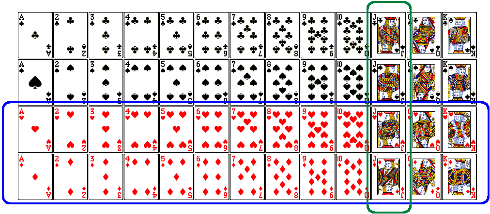
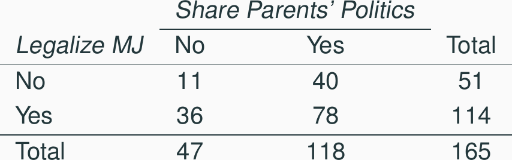
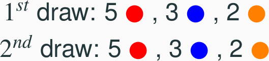
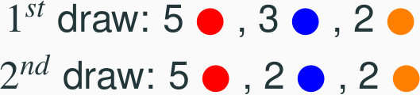
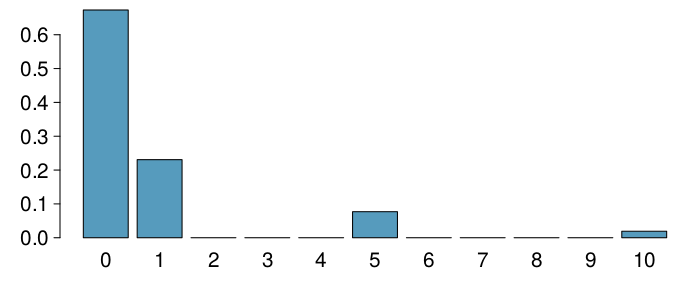
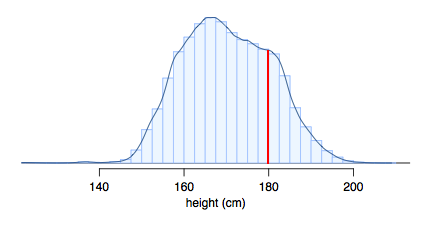

<style>
citation {
  font-size: 4px;
}
</style>

<!--  Version 1.0-0

      This version of the slides is taken directly from Mine Çetinkaya-Rundel's lecture slides
      posted on OpenIntro.org in PDF (LaTeX) format, and moved to Rmd. Topic of Chapter 2
      of OpenIntro Statistics, Probability.
      
      A large part of the HTML/CSS formatting is janky, and could be cleaned up. Feel free to issue a 
      pull request if you love HTML and CSS and want to fix this up.
      
      - wburr, Sept 21, 2018
-->

<!--
<center>
```{r, out.width = "800px", echo = FALSE}
knitr::include_graphics("fig/fig_1_7_boxplots.png")
```
</center>-->

<!-- Chapter 2.1 -->
# Defining Probability

## Random processes

<div style= "float:right;position: relative; left: 10px; top: -20px;">
<center>
```{r, out.width = "400px", echo = FALSE}
knitr::include_graphics("fig/iTunes.png")
```
</center>
</div>
<div>
* A **random process** is a situation in which we know what outcomes could happen, but we don't know which particular outcome will happen.
* **Examples**: coin tosses, die rolls, iTunes shuffle, whether the stock market goes up or down tomorrow, etc.
* It can be helpful to model a process as random even if it is not truly random.
</div>

<div id="footnote">http://www.cnet.com.au/itunes-just-how-random-is-random-339274094.htm</div>


## Probability

* There are several possible interpretations of probability but they (almost) completely agree on the mathematical rules probability must follow.
    - $P(A)$ = Probability of event A 
    - $0 \le P(A) \le 1$
    
## Probability: Frequentist

* **Frequentist interpretation:**
    - The probability of an outcome is the proportion of times the outcome would occur if we observed the random process an infinite number of times.
    - relies on a "multiverse" concept for most problems, "if"
    
## Probability: Bayesian

* **Bayesian interpretation:**
    - A Bayesian interprets probability as a subjective degree of belief: For the same event, two separate people could have different viewpoints and so assign different probabilities.
    - Largely popularized by revolutionary advance in computational technology and methods during the last twenty years.

## Practice

**Which of the following events would you be most surprised by?**

1. exactly 3 heads in 10 coin flips
2. exactly 3 heads in 100 coin flips
3. exactly 3 heads in 1000 coin flips

## Practice

**Which of the following events would you be most surprised by?**

1. exactly 3 heads in 10 coin flips
2. exactly 3 heads in 100 coin flips
3. <span id="highlight">exactly 3 heads in 1000 coin flips</span>


## Law of large numbers

The **Law of large numbers** states that as more observations are collected, the proportion of occurrences with a particular outcome, ** $\hat{p}_n$, converges to the probability of that outcome, **$p$**.

## Law of large numbers (cont.)

When tossing a *fair* coin, if heads comes up on each of the first 10 tosses, what do you think the chance is that another head will come up on the next toss? 0.5, less than 0.5, or more than 0.5?

<center>
```{r, out.width = "400px", echo = FALSE}

```
</center>

## Law of large numbers (cont.)

When tossing a *fair* coin, if heads comes up on each of the first 10 tosses, what do you think the chance is that another head will come up on the next toss? 0.5, less than 0.5, or more than 0.5?

<center>
```{r, out.width = "400px", echo = FALSE}

```
</center>

* The probability is still 0.5, or there is still a 50% chance that another head will come up on the next toss.
$$
P(H \text{ on 11}^{th} \text{ toss}) = P(T \text{ on 11}^{th} \text{ toss}) = 0.5 
$$
* The coin is not "due" for a tail.
* The common misunderstanding of the LLN is that random processes are supposed to compensate for whatever happened in the past; this is just not true and is also called the **gambler's fallacy** (or **law of averages**.

## Disjoint and non-disjoint outcomes

**Disjoint (mutually exclusive) outcomes:** Cannot happen at the same time.

* The outcome of a single coin toss cannot be a head and a tail.
* A student both cannot fail and pass a class.
* A single card drawn from a deck cannot be an ace and a queen.

## Disjoint and non-disjoint outcomes

**Disjoint (mutually exclusive) outcomes:** Cannot happen at the same time.

* The outcome of a single coin toss cannot be a head and a tail.
* A student both cannot fail and pass a class.
* A single card drawn from a deck cannot be an ace and a queen.

**Non-disjoint outcomes:** Can happen at the same time.

* A student can get an A in Stats and A in Econ in the same semester.

## Union of non-disjoint events

**What is the probability of drawing a jack or a red card from a well shuffled full deck?**

<center>
```{r, out.width = "400px", echo = FALSE}

```
</center>


$$
\begin{align*}
P(jack~or~red) &= P(jack) + P(red) - P(jack~and~red) \\
&= \frac{4}{52} + \frac{26}{52} - \frac{2}{52} = \frac{28}{52}
\end{align*}
$$

<span id="footnote">Figure from http://www.milefoot.com/math/discrete/counting/cardfreq.htm</span>


## Practice

What is the probability that a randomly sampled student thinks marijuana should be legalized **or** they agree with their parents' political views?

<center>
```{r, out.width = "400px", echo = FALSE}

```
</center>


1. $\frac{40 + 36 - 78}{165}$
2. $\frac{114 + 118 - 78}{165}$
3. $\frac{78}{165}$
4. $\frac{78}{188}$
5. $\frac{11}{47}$

## Practice

What is the probability that a randomly sampled student thinks marijuana should be legalized **or** they agree with their parents' political views?

<center>
```{r, out.width = "400px", echo = FALSE}

```
</center>


1. $\frac{40 + 36 - 78}{165}$
2. <span id="highlight">$\frac{114 + 118 - 78}{165}$</span>
3. $\frac{78}{165}$
4. $\frac{78}{188}$
5. $\frac{11}{47}$

## Recap

**General addition rule** $P(A~or~B) = P(A) + P(B) - P(A~and~B)$ 

For disjoint events $P(A~and~B) = 0$, so the above formula simplifies to $P(A~or~B) = P(A) + P(B)$.

## Probability distributions

A **probability distribution** lists all possible events and the probabilities with which they occur.

* The probability distribution for the gender of one child:

Event        Male      Female
------       -----     --------
Probability  0.5       0.5

## Probability distributions

A **probability distribution** lists all possible events and the probabilities with which they occur.

* Rules for probability distributions:
    - The events listed must be disjoint
    - Each probability must be between 0 and 1
    - The probabilities must total 1

## Probability distributions

A **probability distribution** lists all possible events and the probabilities with which they occur.
   
* The probability distribution for the genders of two children:

Event        MM    FF    MF    FM
-----        ---   ---   ---   ---
Probability  0.25  0.25  0.25  0.25
    
    
## Practice

In a survey, 52% of respondents said they like pizza. What is the probability that a randomly selected respondent from this sample is a **pizza hater**.

1. 0.48
2. more than 0.48
3. less than 0.48
4. cannot calculate using only the information given

## Practice

In a survey, 52% of respondents said they like pizza. What is the probability that a randomly selected respondent from this sample is a **pizza hater**.

1. 0.48
2. more than 0.48
3. less than 0.48
4. <span id="highlight">cannot calculate using only the information given</span>

**More**: If the only two states people can be in are **pizza likers** and **pizza haters**, then the first option (1) is possible. However, it is also possible there are people who are ambivalent about pizza, or love pizza (more than like?), or who have never eaten pizza! The only answer we can eliminate is (b), because it is impossible by the rules of probability.

## Sample space and complements

The **sample space** is the collection of all possible outcomes of a trial (or experiment).

* A couple has one child, what is the sample space for the gender of this child? $S = \{ M, F \}$
* A couple has two children, what is the sample space for the gender of these children? $S =$

## Sample space and complements

The **sample space** is the collection of all possible outcomes of a trial (or experiment).

* A couple has one child, what is the sample space for the gender of this child? $S = \{ M, F \}$
* A couple has two children, what is the sample space for the gender of these children? $S = \{ MM, FF, FM, MF \}$

## Sample space and complements

The **sample space** is the collection of all possible outcomes of a trial (or experiment).

* A couple has one child, what is the sample space for the gender of this child? $S = \{ M, F \}$
* A couple has two children, what is the sample space for the gender of these children? $S = \{ MM, FF, FM, MF \}$

**Complementary events** are two mutually exclusive events whose probabilities that add up to 1.

* A couple has one child. If we know that the child is not a boy, what is gender of this child?
$\{ M, F \}$. Male and female are **complementary** outcomes.
* A couple has two children, if we know that they are not both female, what are the possible gender combinations for these children? $\{ MM, FF, FM, MF \}$

## Independence

Two processes are said to be **independent** of one another if knowing the outcome of one provides no useful information about the outcome of the other.

* Knowing that the coin landed on a head on the first toss **does not** provide any useful information for determining what the coin will land on in the second toss. $\rightarrow$ Outcomes of two tosses of a coin are independent.

## Independence

Two processes are said to be **independent** of one another if knowing the outcome of one provides no useful information about the outcome of the other.

* Knowing that the coin landed on a head on the first toss **does not** provide any useful information for determining what the coin will land on in the second toss. $\rightarrow$ Outcomes of two tosses of a coin are independent.
* Knowing that the first card drawn from a deck is an ace **does** provide useful information for determining the probability of drawing an ace in the second draw. $\rightarrow$ Outcomes of two draws from a deck of cards (without replacement) are dependent.

## Practice

<span style="font-size: 18px;">Between January 9-12, 2013, SurveyUSA interviewed a random sample of 500 North Carolina residents asking them whether they think widespread gun ownership protects law abiding citizens from crime, or makes society more dangerous. 58% of all respondents said it protects citizens. 67% of  White respondents, 28% of Black respondents, and 64% of Hispanic respondents shared this view. Which of the below is true?</span>

<span style="font-size: 18px;">Opinions on gun ownership and race ethnicity are most likely</span>

1. complementary
2. mutually exclusive
3. independent
4. dependent
5. disjoint

<br>
<span id="footnote">http://www.surveyusa.com/client/PollReport.aspx?g=a5f460ef-bba9-484b-8579-1101ea26421b</span>

## Practice

<span style="font-size: 20px;">Between January 9-12, 2013, SurveyUSA interviewed a random sample of 500 North Carolina residents asking them whether they think widespread gun ownership protects law abiding citizens from crime, or makes society more dangerous. 58% of all respondents said it protects citizens. 67% of  White respondents, 28% of Black respondents, and 64% of Hispanic respondents shared this view. Which of the below is true?

Opinions on gun ownership and race ethnicity are most likely</span>

1. complementary
2. mutually exclusive
3. independent
4. <span id="highlight">dependent</span>
5. disjoint
</span>

<br>
<span id="footnote">http://www.surveyusa.com/client/PollReport.aspx?g=a5f460ef-bba9-484b-8579-1101ea26421b</span>

## $\;$

**Checking for independence**: 

If P(A occurs, given that B is true) = $P(A~|~B) = P(A)$, then A and B are independent.

## The Gun Ownership Question

* P(protects citizens) = 0.58 
* P(randomly selected NC resident says gun ownership protects citizens, given that the resident is white) =  P(protects citizens $|$ White) = 0.67 
* P(protects citizens $|$ Black) = 0.28 
* P(protects citizens $|$ Hispanic) = 0.64 

P(protects citizens) varies by race/ethnicity, therefore opinion on gun ownership and race ethnicity are most likely dependent.


## Determining dependence based on sample data

* If conditional probabilities calculated based on sample data suggest dependence between two variables, the next step is to conduct a hypothesis test to determine if the observed difference between the probabilities is likely or unlikely to have happened by chance.
* If the observed difference between the conditional probabilities is large, then there is stronger evidence that the difference is real.
* If a sample is large, then even a small difference can provide strong evidence of a real difference.

## More on dependence

We saw that P(protects citizens $|$ White) = 0.67 and P(protects citizens $|$ Hispanic) = 0.64. Under which condition would you be more convinced of a real difference between the proportions of Whites and Hispanics who think gun widespread gun ownership protects citizens? $n = 500$ or $n = 50,000$

## $\;$

**Product rule for independent events**: $P(A~and~B) = P(A) \times P(B)$

<br>
More generally, $P(A_1~and~\cdots~and~A_k) = P(A_1) \times \cdots \times P(A_k)$

## Example

You toss a coin twice, what is the probability of getting two tails in a row?

<br>
$P(\text{T on the first toss}) \times  P(\text{T on the second toss}) = \frac{1}{2} \times \frac{1}{2} = \frac{1}{4}$

## Practice

A recent Gallup poll suggests that 25.5% of Texans do not have health insurance as of June 2012. Assuming that the uninsured rate stayed constant, what is the probability that two randomly selected Texans are both uninsured?

<div style= "float:right;position: relative; left: 10px; top: -20px;">
<center>
```{r, out.width = "500px", echo = FALSE}
knitr::include_graphics("fig/uninsured.jpg")
```
</center>
</div>
<div>
* $25.5^2$
* $0.255^2$ 
* $0.255 \times 2$
* $(1 - 0.255)^2$
</div>


<span id="footnote">http://www.gallup.com/poll/156851/uninsured-rate-stable-across-states-far-2012.aspx</span>

## Disjoint vs. complementary

**Do the sum** of probabilities of two disjoint events always add up to 1?

## Disjoint vs. complementary

**Do the sum** of probabilities of two disjoint events always add up to 1?

Not necessarily, there may be more than 2 events in the sample space, e.g. party affiliation.

## Disjoint vs. complementary

**Do the sum** of probabilities of two disjoint events always add up to 1?

Not necessarily, there may be more than 2 events in the sample space, e.g. party affiliation.

<br>

**Do the sum** of probabilities of two complementary events always add up to 1?

## Disjoint vs. complementary

**Do the sum** of probabilities of two disjoint events always add up to 1?

Not necessarily, there may be more than 2 events in the sample space, e.g. party affiliation.

<br>

**Do the sum** of probabilities of two complementary events always add up to 1?

Yes, that's the definition of complementary, e.g. heads and tails. 

## Putting everything together...

**If** we were to randomly select 5 Texans, what is the probability that at least one is uninsured?

* If we were to randomly select 5 Texans, the sample space for the number of Texans who are uninsured would be:
$S = \{0, 1, 2, 3, 4, 5\}$
* We are interested in instances where at least one person is uninsured:
$S = \{0,$ **1, 2, 3, 4, 5**$\}$
* So we can divide up the sample space into two categories:
$S = \{0,$ **at least one**$\}$

## Putting everything together...

Since the probability of the sample space must add up to 1, and
$P(\text{at least one}) = 1 - P(\text{none})$

$$
\begin{split}
\text{Prob}(\text{at least 1 uninsured}) &= 1 - \text{Prob}(\text{none uninsured}) \\
&= 1 - [(1-0.255)^5] \\
&= 1- 0.745^5 \\
&= 1 - 0.23 \\
&= 0.77
\end{split}
$$


## Practice

Roughly 20% of undergraduates at a university are vegetarian or vegan. What is the probability that, among a random sample of 3 undergraduates, at least one is vegetarian or vegan?

* $1 - 0.2 \times 3$
* $1 - 0.2^3$
* $0.8^3$
* $1 - 0.8 \times 3$
* $1 - 0.8^3$


## Practice

$$
\begin{split}
P(\text{at least 1 from veg}) &= 1- P(\text{none veg})\\
&= 1 - (1 - 0.2)^3\\
&= 1 - 0.8^3\\
&= 1 - 0.512 = 0.488\\
\end{split}
$$

## Practice

Roughly 20% of undergraduates at a university are vegetarian or vegan. What is the probability that, among a random sample of 3 undergraduates, at least one is vegetarian or vegan?

* $1 - 0.2 \times 3$
* $1 - 0.2^3$
* $0.8^3$
* $1 - 0.8 \times 3$
* <span id="highlight">$1 - 0.8^3$</span>

<!-- Chapter 2.2 -->

# Conditional probability

## Relapse

Researchers randomly assigned 72 chronic users of cocaine into three groups: desipramine (antidepressant), lithium (standard treatment for cocaine) and placebo. Results of the study are summarized below.

$\;$             relapse  	no relapse   total 
--------------   --------   -----------  ------
desipramine	      10		     14           24 
lithium           18          6           24 
placebo           20          4		        24 
total             48         24           72

<span id="footnote">http://www.oswego.edu/~srp/stats/2_way_tbl_1.htm</span>

## Marginal probability

**What is the probability that a patient relapsed?**

$\;$             relapse  	no relapse   total 
--------------   --------   -----------  ------
desipramine	      10		     14           24 
lithium           18          6           24 
placebo           20          4		        24 
total             48         24           72

## Marginal probability

**What is the probability that a patient relapsed?**

$\;$             relapse  	no relapse   total 
--------------   --------   -----------  ------
desipramine	      10		     14           24 
lithium           18          6           24 
placebo           20          4		        24 
total             **48**     24          **72**

<br>
$P(\text{relapsed}) = \frac{48}{72} \approx 0.67$

## Joint probability

**What is the probability that a patient received the antidepressant (desipramine) and relapsed?**


$\;$             relapse  	no relapse   total 
--------------   --------   -----------  ------
desipramine	      **10**		 14           24 
lithium           18          6           24 
placebo           20          4		        24 
total             48         24          **72**

<br>
$P(\text{relapsed and desipramine}) = \frac{10}{72} \approx 0.14$

## Conditional probability

**The conditional probability of the outcome of interest $A$ given condition $B$ is calculated as**

$P(A|B) = \frac{P(A\text{ and }B)}{P(B)}$

$\;$             relapse  	no relapse   total 
--------------   --------   -----------  ------
desipramine	      10    		 14           24 
lithium           18          6           24 
placebo           20          4		        24 
total             48         24           72

## Conditional probability

**The conditional probability of the outcome of interest $A$ given condition $B$ is calculated as**

$$
\begin{split}
P(\text{relapse} | \text{desipramine}) &= \frac{P(\text{relapse and desipramine})}{P(\text{desipramine})} \\
&= \frac{10 / 72}{24 / 72} \\
&= \frac{10}{24} = 0.42
\end{split}
$$


## Conditional probability (cont.)

**If we know that a patient received the antidepressant (desipramine), what is the probability that they relapsed?**

$\;$             relapse  	no relapse   total 
--------------   --------   -----------  -------
desipramine	      **10**     14           **24**
lithium           18          6           24 
placebo           20          4		        24 
total             48         24           72

$$
\begin{split}
P(\text{relapse} | \text{desipramine}) &= \frac{10}{24} \approx 0.42
\end{split}
$$


## Conditional probability (cont.)

$$
\begin{split}
P(\text{relapse} | \text{desipramine}) &= \frac{10}{24} \approx 0.42\\
P(\text{relapse} | \text{lithium}) &= \frac{18}{24} \approx 0.75 \\
P(\text{relapse} | \text{placebo}) &= \frac{20}{24} \approx 0.83 \\
\end{split}
$$


## Conditional probability (cont.)

**If we know that a patient relapsed, what is the probability that they received the antidepressant (desipramine)?**

$\;$             relapse  	no relapse   total 
--------------   --------   -----------  -------
desipramine	      **10**     14           24
lithium           18          6           24 
placebo           20          4		        24 
total             **48**     24           72

$$
\begin{split}
P(\text{desipramine}|\text{relapse}) &= \frac{10}{48} \approx 0.21
\end{split}
$$


## General multiplication rule

* Earlier we saw that if two events are independent, their joint probability is simply the product of their probabilities. If the events are not believed to be independent, the joint probability is calculated slightly differently.
* If $A$ and $B$ represent two outcomes or events, then $P(\text{A and B}) = P(A|B) \times P(B)$
Note that this formula is simply the conditional probability formula, rearranged.
* It is useful to think of $A$ as the outcome of interest and $B$ as the condition.


## Independence and conditional probabilities

Consider the following (hypothetical) distribution of gender and major of students in an introductory statistics class:

         social science   non-social science   total 
-------  ---------------  -------------------  ------
female    30               20                    50 
male      30               20                    50 
total     60               40                   100


* <span style="font-size:18px;">The probability that a randomly selected student is a social science major is \pause $\frac{60}{100} = 0.6$. </span>
* <span style="font-size:18px;">The probability that a randomly selected student is a social science major given that they are female is \pause $\frac{30}{50} = 0.6$. </span>
* <span style="font-size:18px;">Since $P(SS | M)$ also equals 0.6, major of students in this class does not depend on their gender: P(SS $|$ F) = P(SS).</span>

## Independence and conditional probabilities (cont.)

Generically, if $P(A|B) = P(A)$ then the events $A$ and $B$ are said to be independent.

* Conceptually: Giving $B$ doesn't tell us anything about $A$.
* Mathematically: We know that if events $A$ and $B$ are independent, $P(A~and~B) = P(A) \times P(B)$. Then, 

$$
P(A|B) = \frac{P(\text{A\text{ and }B})}{P(B)} = \frac{P(A) \times P(B)}{P(B)} = P(A)
$$

## Breast cancer screening

* American Cancer Society estimates that about 1.7% of women have breast cancer. 
* Susan G. Komen For The Cure Foundation states that mammography correctly identifies about 78% of women who truly have breast cancer. 
* An article published in 2003 suggests that up to 10% of all mammograms result in false positives for patients who do not have cancer. 

<br>
**These percentages are approximate, and very difficult to estimate.**

<div id="footnote">http://www.cancer.org/cancer/cancerbasics/cancer-prevalence <br>
http://ww5.komen.org/BreastCancer/AccuracyofMammograms.html <br>
http://www.ncbi.nlm.nih.gov/pmc/articles/PMC1360940</div>

## Inverting probabilities

When a patient goes through breast cancer screening there are two competing claims: patient had cancer and patient doesn't have cancer. If a mammogram yields a positive result, what is the probability that patient actually has cancer?

<center>
```{r, out.width = "600px", echo = FALSE}
knitr::include_graphics("fig/cancer_tree_first.png")
```
</center>

## Inverting probabilities (ctd.)

$$
\begin{split}
P(C | +) &= \frac{P(\text{C and +})}{P(+)} \\
&= \frac{0.0133}{0.0133 + 0.0983} \\
&= 0.12
\end{split}
$$

**Note**: Tree diagrams are useful for inverting probabilities: we are given $P(+|C)$ and asked for $P(C|+)$.


## Practice

Suppose a woman who gets tested once and obtains a positive result wants to get tested again. In the second test, what should we assume to be the probability of this specific woman having cancer?

* 0.017
* 0.12
* 0.0133
* 0.88

## Practice

Suppose a woman who gets tested once and obtains a positive result wants to get tested again. In the second test, what should we assume to be the probability of this specific woman having cancer?

* 0.017
* <span id="highlight">0.12</span>
* 0.0133
* 0.88

## Practice

What is the probability that this woman has cancer if this second mammogram also yielded a positive result?

<center>
```{r, out.width = "600px", echo = FALSE}
knitr::include_graphics("fig/cancer_tree_first.png")
```
</center>

## Practice

What is the probability that this woman has cancer if this second mammogram also yielded a positive result?

* 0.0936
* 0.088
* 0.48
* 0.52

## Practice

What is the probability that this woman has cancer if this second mammogram also yielded a positive result?

* 0.0936
* 0.088
* 0.48
* <span id="highlight">0.52</span>

$P(C | +) = \frac{P(\text{C and +})}{P(+)} = \frac{0.0936}{0.0936+0.088} = 0.52$


## Bayes' Theorem

* The conditional probability formula we have seen so far is a special case of the Bayes' Theorem, which is applicable even when events have more than just two outcomes.
* **Bayes' Theorem:**
$$
\begin{split}
P(\text{outcome }&A_1\text{ of variable 1}|\text{outcome B of variable 2}) \\
 &=\frac{P(B|A_1)P(A_1)}{P(B|A_1)P(A_1) + P(B|A_2)P(A_2) + \cdots + P(B|A_k)P(A_k)}
\end{split}
$$
where $A_2$, $\cdots$, $A_k$ represent all other possible outcomes of variable 1.

## Application activity: Inverting probabilities

<span style="font-size:20px;">A common epidemiological model for the spread of diseases is the SIR model, where the population is partitioned into three groups: Susceptible, Infected, and Recovered. This is a reasonable model for diseases like chickenpox where a single infection usually provides immunity to subsequent infections. Sometimes these diseases can also be difficult to detect. </span>

<span style="font-size:20px;">Imagine a population in the midst of an epidemic where 60% of the population is considered susceptible, 10% is infected, and 30% is recovered. The only test for the disease is accurate 95% of the time for susceptible individuals, 99% for infected individuals, but 65% for recovered individuals. (Note: In this case accurate means returning a negative result for susceptible and recovered individuals and a positive result for infected individuals).</span>

<span style="font-size:20px;">Draw a probability tree to reflect the information given above. If the individual has tested positive, what is the probability that they are actually infected?</span>


## Application activity: Inverting probabilities (cont.)

<center>
```{r, out.width = "700px", echo = FALSE}
knitr::include_graphics("fig/sir_tree.png")
```
</center>

$$
P(\text{inf } |\, +) = \frac{P(\text{inf and } +)}{P(+)} = \frac{0.099}{0.03 + 0.099 + 0.105} \approx 0.423
$$

<!-- page 106 of original LaTeX slides: this covers 2-1 and 2-2. Need to still transcribe 2-3+. --  >

<!-- Chapter 2.3 -->
# Sampling from small populations

## Sampling with replacement

When sampling **with replacement**, you put back what you just drew.

* Imagine you have a bag with 5 red, 3 blue and 2 orange chips in it. What is the probability that the first chip you draw is blue?

<center>

</center>

## Sampling with replacement

When sampling **with replacement**, you put back what you just drew.

* Imagine you have a bag with 5 red, 3 blue and 2 orange chips in it. What is the probability that the first chip you draw is blue?

<center>

</center>

$$
Prob(1^{st} \text{ chip } B) = \frac{3}{5 + 3 + 2} = \frac{3}{10} = 0.3
$$

## Sampling with replacement

When sampling **with replacement**, you put back what you just drew.

* Suppose you did indeed pull a blue chip in the first draw. If drawing with replacement, what is the probability of drawing a blue chip in the second draw?

<center>

</center>

## Sampling with replacement

When sampling **with replacement**, you put back what you just drew.

* Suppose you did indeed pull a blue chip in the first draw. If drawing with replacement, what is the probability of drawing a blue chip in the second draw?

<center>

</center>

$$
Prob(2^{nd} \text{ chip } B | 1^{st} \text{ chip } B) = \frac{3}{10} = 0.3
$$

## Sampling with replacement (cont.)

* Suppose you actually pulled an orange chip in the first draw. If drawing with replacement, what is the probability of drawing a blue chip in the second draw?

<center>

</center>

## Sampling with replacement (cont.)

* Suppose you actually pulled an orange chip in the first draw. If drawing with replacement, what is the probability of drawing a blue chip in the second draw?

<center>

</center>

$$
Prob(2^{nd} \text{ chip } B | 1^{st} \text{ chip } O) = \frac{3}{10} = 0.3
$$

## Sampling with replacement (cont.)

* If drawing with replacement, what is the probability of drawing two blue chips in a row?

<center>

</center>

## Sampling with replacement (cont.)

* If drawing with replacement, what is the probability of drawing two blue chips in a row?

<center>

</center>

$$
Prob(1^{st} \text{ chip } B) \cdot Prob(2^{nd} \text{ chip } B | 1^{st} \text{ chip } B) \\= 0.3 \times 0.3 
 = 0.3^2 = 0.09 
$$

## Sampling with replacement (cont.)

* When drawing with replacement, probability of the second chip being blue does not depend on the color of the first chip since whatever we draw in the first draw gets put back in the bag.
$$
Prob(B | B) = Prob(B | O) 
$$
* In addition, this probability is equal to the probability of drawing a blue chip in the first draw, since the composition of the bag never changes when sampling with replacement.
$$
Prob(B | B) = Prob(B)
$$
* **When drawing with replacement, draws are independent.**

## Sampling without replacement

When drawing *without replacement* you do not put back what you just drew.

* Suppose you pulled a blue chip in the first draw. If drawing without replacement, what is the probability of drawing a blue chip in the second draw?

<center>

</center>

## Sampling without replacement

When drawing *without replacement* you do not put back what you just drew.

* Suppose you pulled a blue chip in the first draw. If drawing without replacement, what is the probability of drawing a blue chip in the second draw?

<center>

</center>

$$
Prob(2^{nd} \text{ chip } B | 1^{st} \text{ chip } B) = \frac{2}{9} = 0.22 
$$

## Sampling without replacement

When drawing *without replacement* you do not put back what you just drew.

* If drawing without replacement, what is the probability of drawing two blue chips in a row?

<center>

</center>

## Sampling without replacement

When drawing *without replacement* you do not put back what you just drew.

* If drawing without replacement, what is the probability of drawing two blue chips in a row?

<center>

</center>

$$
Prob(1^{st} \text{ chip } B) \cdot Prob(2^{nd} \text{ chip } B | 1^{st} \text{ chip } B)  \\
= 0.3 \times 0.22 = 0.066 
$$

## Sampling without replacement (cont.)

* When drawing without replacement, the probability of the second chip being blue given the first was blue is not equal to the probability of drawing a blue chip in the first draw since the composition of the bag changes with the outcome of the first draw.
$$
Prob(B | B) \ne Prob(B)
$$

* **When drawing without replacement, draws are not independent.**
* This is especially important to take note of when the sample sizes are small. If we were dealing with, say, 10,000 chips in a (giant) bag, taking out one chip of any color would not have as big an impact on the probabilities in the second draw.

## Practice

**In most card games cards are dealt without replacement. What is the probability of being dealt an ace and then a 3? Choose the closest answer.**

1. 0.0045
2. 0.0059
3. 0.0060
4. 0.1553

## Practice

**In most card games cards are dealt without replacement. What is the probability of being dealt an ace and then a 3? Choose the closest answer.**

1. 0.0045
2. 0.0059
3. <span id="highlight">0.0060</span>
4. 0.1553

$$
P(\text{ace then 3}) = \frac{4}{52} \times \frac{4}{51} \approx 0.0060 
$$

# Random variables

## Random variables

* A **random variable** is a numeric quantity whose value depends on the outcome of a random event
    - We use a capital letter, like $X$, to denote a random variable
    - The values of a random variable are denoted with a lowercase letter, in this case $x$
    - We write this as $P(X = x)$
 
## Random variables

* A **random variable** is a numeric quantity whose value depends on the outcome of a random event
    - We use a capital letter, like $X$, to denote a random variable
    - The values of a random variable are denoted with a lowercase letter, in this case $x$
    - We write this as $P(X = x)$
* There are two types of random variables:
    - **Discrete random variables** often take only integer values
        * **Example**: Number of credit hours, Difference in number of credit hours this term vs last
    - **Continuous random variables** take real (decimal) values
        * **Example**: Cost of books this term, Difference in cost of books this term vs last

## Expectation

* We are often interested in the average outcome of a random variable.
* We call this the **expected value**, or **mean**, and it is a weighted average of the possible outcomes
$$
\mu = E(X) = \sum_{i = 1}^k x_i ~ P(X = x_i)
$$

## Expected value of a discrete random variable

In a game of cards you win \$1 if you draw a heart, \$5 if you draw an ace (including the ace of hearts), \$10 if you draw the king of spades and nothing for any other card you draw. Write the probability model for your winnings, and calculate your expected winning.

Event		          $X$ 		          $P(X)$        	   $X ~ P(X)$ 
------            -----             -----------------  ----------------
Heart (not ace)	  $1$		            12/52              12/52          
Ace			          $5$	          	  4/52               20/52             	
King of spades	  $10$		          1/52               10/52           
All else		      $0$		            35/52              0

## Expected value of a discrete random variable

Event		          $X$ 		          $P(X)$        	   $X ~ P(X)$ 
------            -----             -----------------  ----------------
Heart (not ace)	  $1$		            12/52              12/52          
Ace			          $5$	          	  4/52               20/52             	
King of spades	  $10$		          1/52               10/52           
All else		      $0$		            35/52              0
Total                                                  $E[X] = 42/52 \approx 0.81$

## Expected value of a discrete random variable (cont.)

Below is a visual representation of the probability distribution of winnings from this game:

<center>

</center>

## Variability in random variables

We are also often interested in the variability in the values of a random variable.

$$
\sigma^2 = Var(X) = \sum_{i = 1}^k \left(x_i - E(X)\right)^2 P(X = x_i)\\
\;\\
\sigma = SD(X) = \sqrt{Var(X)}
$$

## Variability of a discrete random variable

**For the previous card game example, how much would you expect the winnings to vary from game to game?**

$X$       $P(X)$       $X~P(X)$            $(X-E[X])^2$             $P(X)\cdot (X-E[X])^2$
-----     ----------   ------------------  ----------------------   --------------------------
1         12/52        1 x 12/52 = 12/52   $(1-0.81)^2 = 0.0361     12/52 x 0.0361 = 0.0083
5         4/52         5 x 4/52 = 20/52    $(5-0.81)^2 = 17.5561    4/52 x 17.5561 = 1.3505
10        1/52         10 x 1/52 = 10/52   $(10-0.81)^2 = 84.4561   1/52 x 84.0889 = 1.6242
0         35/52        0 x 35/52 = 0       $(0-0.81)^2 = 0.6561     35/52 x 0.6561 = 0.4416
                       $E[X] = 0.81$
                       
## Variability of a discrete random variable

**For the previous card game example, how much would you expect the winnings to vary from game to game?**

$X$       $P(X)$       $X~P(X)$            $(X-E[X])^2$             $P(X)\cdot (X-E[X])^2$
-----     ----------   ------------------  ----------------------   --------------------------
1         12/52        1 x 12/52 = 12/52   $(1-0.81)^2 = 0.0361     12/52 x 0.0361 = 0.0083
5         4/52         5 x 4/52 = 20/52    $(5-0.81)^2 = 17.5561    4/52 x 17.5561 = 1.3505
10        1/52         10 x 1/52 = 10/52   $(10-0.81)^2 = 84.4561   1/52 x 84.0889 = 1.6242
0         35/52        0 x 35/52 = 0       $(0-0.81)^2 = 0.6561     35/52 x 0.6561 = 0.4416
                       $E[X] = 0.81$                                $V[X] = 3.4246$
                                                                    $SD(X) = \sqrt{3.4246} = 1.85$
                                                                    

## Variability: the R way

We could also do all of this in R, and it's easier: no tracking decimals, no computations!
```{r}
x <- c(1, 5, 10, 0)
pX <- c(12/52, 4/52, 1/52, 35/52)
var <- pX * (x - sum(x * pX))^2
var
sum(var)
```

## Linear combinations of random variables

* A **linear combination** of random variables $X$ and $Y$ is given by
$$
aX + bY 
$$
where $a$ and $b$ are some fixed numbers.

## Linear combinations of random variables

* A **linear combination** of random variables $X$ and $Y$ is given by
$$
aX + bY 
$$
where $a$ and $b$ are some fixed numbers.
* The average value of a linear combination of random variables is given by
$$
E(aX + bY) = a \times E(X) + b \times E(Y)
$$

## Calculating the expectation of a linear combination

On average you take 10 minutes for each statistics homework problem and 15 minutes for each chemistry homework problem. This week you have 5 statistics and 4 chemistry homework problems assigned. What is the total time you expect to spend on statistics and physics homework for the week?

## Calculating the expectation of a linear combination

On average you take 10 minutes for each statistics homework problem and 15 minutes for each chemistry homework problem. This week you have 5 statistics and 4 chemistry homework problems assigned. What is the total time you expect to spend on statistics and physics homework for the week?

$$
\begin{split}
E(S + S + S + S + S + C + C + C + C) &= 5 \times E(S) + 4 \times E(C) \\
&= 5 \times 10 + 4 \times 15 \\
&= 50 + 60 \\
&= 110~\text{min }
\end{split}
$$

## Variability in linear combinations of random variables

* The variability of a linear combination of two independent random variables is calculated as
$$
V(aX + bY) = a^2 \times V(X) + b^2 \times V(Y)
$$
* The standard deviation of the linear combination is the square root of the variance.

**If the random variables are not independent, the variance calculation gets a little more complicated and is beyond the scope of this course.**

## Calculating the variance of a linear combination

The standard deviation of the time you take for each statistics homework problem is 1.5 minutes, and it is 2 minutes for each chemistry problem. What is the standard deviation of the time you expect to spend on statistics and physics homework for the week if you have 5 statistics and 4 chemistry homework problems assigned? Suppose that the time it takes to complete each problem is independent of another.

## Calculating the variance of a linear combination

The standard deviation of the time you take for each statistics homework problem is 1.5 minutes, and it is 2 minutes for each chemistry problem. What is the standard deviation of the time you expect to spend on statistics and physics homework for the week if you have 5 statistics and 4 chemistry homework problems assigned? Suppose that the time it takes to complete each problem is independent of another.

$$
\begin{split}
V(5~S \text{ and } 4~C) &= V(S) + V(S) + V(S) + V(S) + \\ &\phantom{==}V(S) + V(C) + V(C) + V(C) + V(C) \\
&= 5 \times V(S) + 4 \times V(C) \\
&= 5 \times 1.5^2 + 4 \times 2^2 \\
&= 27.25
\end{split}
$$

## Calculating Variance: the R way

```{r}
5 * 1.5^2 + 4 * 2^2
```

## Practice

A casino game costs \$5 to play. If the first card you draw is red, then you get to draw a second card (without replacement). If the second card is the ace of clubs, you win \$500. If not, you don't win anything, i.e. lose your \$5. What is your expected profits/losses from playing this game? **<span style="font-size:16px;">Remember: profit/loss = winnings - cost.</span>**

* A profit of 5 cents
* A loss of 10 cents
* A loss of 25 cents
* A loss of 30 cents

## Practice

A casino game costs \$5 to play. If the first card you draw is red, then you get to draw a second card (without replacement). If the second card is the ace of clubs, you win \$500. If not, you don't win anything, i.e. lose your \$5. What is your expected profits/losses from playing this game? **<span style="font-size:16px;">Remember: profit/loss = winnings - cost.</span>**

$$
\text{A profit of 5 cents}\qquad \text{A loss of 25 cents}\\
\text{A loss of 10 cents} \qquad \text{A loss of 30 cents}
$$

Event                     Win             Profit:$~X$              $P(X)$                                        $X\cdot P(X)$
--------                  -----------     --------------------     ------------------------------------------    -------------------
**Red**, A{$\clubsuit$}   500             $500 - 5 = 495$          $\frac{26}{52} \cdot\frac{1}{51} = 0.0098$    $495 \times 0.0098 = 4.851$ 
Other                     0               $0 - 5 = -5$             $1 - 0.0098 = 0.9902$                         $-5 \times 0.9902 = -4.951$ 
                                                                                                                 $E(X) = -0.1$

## Fair game

A **fair** game is defined as a game that costs as much as its expected payout, i.e. expected profit is 0.

## Fair game

A **fair** game is defined as a game that costs as much as its expected payout, i.e. expected profit is 0.

**Do you think casino games in Vegas cost more or less than their expected payouts?**

<div style= "float:right;position: relative; left: 10px; top: -20px;">
<center>
```{r, out.width = "400px", echo = FALSE}
knitr::include_graphics("fig/bellagio.jpg")
```
</center>
</div>
If those games cost less than their expected payouts, it would mean that the casinos would be losing money on average, and hence they wouldn't be able to pay for all this:

<span id="footnote">Image by Moyan_Brenn on Flickr http://www.flickr.com/photos/aigle_dore/5951714693</span>

## Simplifying random variables

Random variables do not work like normal algebraic variables:
$$
X + X \ne 2X
$$

## Simplifying random variables

Random variables do not work like normal algebraic variables:
$$
X + X \ne 2X
$$

$$
\begin{align*}
E(X + X) &= E(X) + E(X) \\
&= 2 E(X) \\
&~  \\
E(2X) &= 2 E(X) \\
&~ 
\end{align*}
$$

## Simplifying random variables (cont.)
$$
\begin{align*}
Var(X + X) &= Var(X) + Var(X)~{\scriptsize \text{(assuming independence)}} \\
&= 2~Var(X) \\
&~  \\
Var(2X) &= 2^2~Var(X) \\
&= 4~Var(X)
\end{align*}
$$

**So**:
$$
E(X + X)  = E(2X), \text{ but }  Var(X + X) \ne Var(2X)
$$

## Adding or multiplying?

A company has 5 Lincoln Town Cars in its fleet. Historical data show that annual maintenance cost for each car is on average \$2,154 with a standard deviation of \$132. What is the mean and the standard deviation of the total annual maintenance cost for this fleet?

Note that we have 5 cars each with the given annual maintenance cost $(X_1 + X_2 + X_3 + X_4 + X_5)$, not one car that had 5 times the given annual maintenance cost $(5X)$.

$$
\begin{split}
E(X_1 + X_2 + X_3 + X_4 + X_5) &=& E(X_1) + E(X_2) + \cdots + E(X_5) \\
&=& 5 \times E(X) = 5 \times 2,154 = \$ 10,770 \\
Var(X_1 + X_2 + X_3 + X_4 + X_5) &=& Var(X_1) + Var(X_2) + \cdots + Var(X_5) \\
&=& 5 \times V(X) = 5 \times 132^2 = \$ 87,120 \\
SD(X_1 + X_2 + X_3 + X_4 + X_5) &=& \sqrt{87,120} =  295.16
\end{split}
$$

# The Binomial Distribution

## Binomial Distribution

A **very** important discrete distribution is the **binomial distribution**, which results when we have:

* a **fixed** number of trials $n$
* only **two** outcomes possible in each trial
* each trial is **independent**
* the probability of a **success** is the same

**Definition**: the binomial distribution counts the number of successes in $n$ independent trials
of an experiment with fixed probability of success $p$

## Binomial Notation

* $n$ - the fixed number of trials/experiments
* $x$ - a specific number of successes we are interested in (must be between $0$ and $n$, obviously)
* $p$ - probability of success in any one trial/experiment
* $P(X)$ - the probability of getting exactly $x$ successes in $n$ trials

## Things To Be Cautious Of

* make sure that $x$ and $p$ are referring to the same event
as success
* make sure that all trials/experiments are independent
* when sampling **without** replacement, make sure your total
number of trials/experiments is small when compraed to population

## Example 1

Suppose you have no idea how to answer the questions on a True/False
test with 10 questions, and you decide to just flip a coin for each one. You then count how many questions you actually got correct. 

* $x =$ number of questions correct
* $n = 10$
* $p = 0.5$ (fair coin?)
* trials are independent, since the coin flips have nothing to do with one another

In this situation, what is the probability of getting at least 6/10?

## Example 2

According to Statistics Canada, as of the last census in 2016,
86.3% of Canadians between the ages of 25 and 64 have a completed
high school diploma, or equivalent. If we randomly select 15
Canadians aged 25-64, what is the probability distribution
of the number of sampled people who have completed a high school
diploma? 

Find the probability that **at least 8 out of 15** randomly
selected Canadians aged 25-64 will have such a diploma.

## The Binomial Probability Formula

$$
P(x) = \frac{n!}{(n-x)!x!} \cdot p^x \cdot (1-p)^{n-x}
$$

Note that this probability formula is for **one specific value of $x$**. So if you are asked something involving multiple cases of
$x$, you have to do multiple computations!

**We will use R to compute these, as they are very, very tedious by hand.**

## Example 2

* $n = 15$
* $p = 0.863$
* $x \geq 8$

Then:
```{r}
sum( dbinom(8:15, 15, 0.863) )
pbinom(q = 7, size = 15, prob = 0.863, lower.tail = FALSE)
```
(Note: we'll talk more about the $q=7$ in a couple of slides)

## R Syntax for Computing Things with Binomials

There are two functions we will use: **dbinom()** and 
**pbinom()**. The **d** stands for **distribution**, and 
corresponds to the formula back two slides.

**Example:**
```{r}
dbinom(x = 6, size = 10, prob = 0.5)
```
This gives the probability of **exactly six correct** answers in ten
trials with a 50/50 probability (Example 1).

## R Syntax for Computing Things with Binomials

**Example:**
```{r}
pbinom(q = 6, size = 10, prob = 0.5, lower.tail = TRUE)
```
This gives the probability of getting **six or less correct**
answers in ten trials, again with a 50/50 probability (like Example 1).

## R Syntax for Computing Things with Binomials

**Example:**
```{r}
pbinom(q = 6, size = 10, prob = 0.5, lower.tail = FALSE)
```
This gives the probability of getting **MORE THAN SIX correct**
answers in ten trials, again with a 50/50 probability (like Example 1).

**Note**: this is **not** "greater than or equal to", it is strictly
**greater than**. That is, if **q = 6**, this means {7, 8, 9, 10},
**not** {6, 7, 8, 9, 10}.

## General R Syntax

```{r, eval = FALSE}
pbinom(q = max or min number of successes,
       size = total number of trials,
       prob = probability of success,
       lower.tail = TRUE for q being max, FALSE for q being min)

dbinom(x = number of successes interested in,
       size = total number of trials,
       prob = probability of success)
```

# Continuous Distributions

## Continuous distributions

* Below is a histogram of the distribution of heights of US adults. 
* The proportion of data that falls in the shaded bins gives the probability that a randomly sampled US adult is between 180 cm and 185 cm (about 5'11" to 6'1").

<center>

</center>

## From histograms to continuous distributions

Since height is a continuous numerical variable, its **probability density function** is a smooth curve.

<center>

</center>


## Probabilities from continuous distributions

Therefore, the probability that a randomly sampled US adult is between 180 cm and 185 cm can also be estimated as the shaded area under the curve.

<center>

</center>

## By definition...

Since continuous probabilities are estimated as "the area under the curve", the probability of a person being exactly 180 cm (or any exact value) is defined as 0.

<center>

</center>

## A Teaser ...

As of the next lecture, we'll be starting Chapter 3, and talking
about specific continuous distributions like the famous **normal**
(also called **Gaussian**).