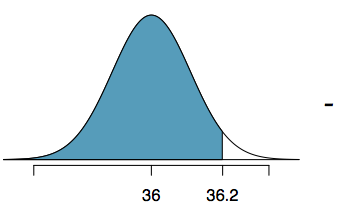
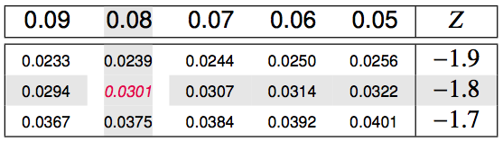

<style>
citation {
  font-size: 4px;
}
</style>

<!--  Version 1.0-0

      This version of the slides is adapted from Mine Çetinkaya-Rundel's lecture slides
      posted on OpenIntro.org in PDF (LaTeX) format, and moved to Rmd. Topic of Chapter 2
      of OpenIntro Statistics & Randomization, Probability. Moved into the OpenIntro Statistics
      coverage 2018.

      A large part of the HTML/CSS formatting is janky, and could be cleaned up. Feel free to issue a
      pull request if you love HTML and CSS and want to fix this up.

      - wburr, Sept 21, 2018
-->

<!--
<center>
```{r, out.width = "800px", echo = FALSE}
knitr::include_graphics("fig/fig_1_7_boxplots.png")
```
</center>-->

# Normal Distribution

## The Normal Distribution
* Unimodal and symmetric, bell shaped curve
* Many variables are nearly normal, but none are exactly normal
* Denoted as $\mathcal{N}(\mu, \sigma) \rightarrow$ Normal with mean $\mu$ and standard deviation $\sigma$

<div style= "float:center; position: relative; top: -25px; left:150px;">
```{r, echo=FALSE, out.width = "550px"}
plot(x = seq(-4, 4, 0.01), y = dnorm(seq(-4, 4, 0.01)), xlab = "", ylab = "", type = "l", yaxt = 'n', xaxt = 'n')
```
</div>

## Heights of Males
<div style= "float:left; position: relative; top:-20px; right:10px;">
```{r, echo=FALSE, out.width = "400px"}
knitr::include_graphics("fig/fig_2_6_okcupid.png")
```
</div>

“The male heights on OkCupid very nearly follow the expected normal distribution -- except the whole thing is shifted to the right of where it should be. Almost universally guys like to add a couple inches.”

“You can also see a more subtle vanity at work: starting at roughly 5'8", the top of the dotted curve tilts even further rightward. This means that guys as they get closer to six feet round up a bit more than usual, stretching for that coveted psychological benchmark.”

<span id="footnote">http://blog.okcupid.com/index.php/the-biggest-lies-in-online-dating</span>

## Heights of Females
<div style= "float:left; position: relative; top:-20px; right:10px;">
```{r, echo=FALSE, out.width = "400px"}
knitr::include_graphics("fig/fig_2_6_okcupid2.png")
```
</div>
“When we looked into the data for women, we were surprised to see height exaggeration was just as widespread, though without the lurch towards a benchmark height.”

<span id="footnote">http://blog.okcupid.com/index.php/the-biggest-lies-in-online-dating</span>

## Normal distributions with different parameters

<div style= "float:center; position: relative; top:-20px; left:200px;">
```{r, echo=FALSE, out.width = "500px"}
knitr::include_graphics("fig/fig_2_6_mu_sd.png")
```
</div>

***
SAT scores are distributed nearly normally with mean 1500 and standard deviation 300. ACT scores are distributed nearly normally with mean 21 and standard deviation 5. A college admissions officer wants to determine which of the two applicants scored better on their standardized test with respect to the other test takers: Pam, who earned an 1800 on her SAT, or Jim, who scored a 24 on his ACT?

<div style= "float:center; position: relative; top:20px; left:200px;">
```{r, echo=FALSE, out.width = "600px"}
knitr::include_graphics("fig/fig_2_6_pam_jim.png")
```
</div>

## Standardizing with Z-scores

Since we cannot just compare these two raw scores, we instead compare how many standard deviations beyond the mean each observation is.

* Pam's score is $(1800 - 1500) / 300 = 1$ standard deviation above the mean.
* Jim's score is $(24 - 21) / 5 = 0.6$ standard deviations above the mean.

<div style= "float:center; position: relative; top:20px; left:200px;">
```{r, echo=FALSE, out.width = "550px"}
knitr::include_graphics("fig/fig_2_6_pam_jim2.png")
```
</div>

## Standardizing with Z-scores (continued)

These are called **standardized scores**, or **Z-scores** (or **Z scores**).

* Z score of an observation is the number of standard deviations it falls above or below the mean.
$$
Z = (\text{observation} - \text{mean}) / \text{SD}
$$
* Z scores are defined for distributions of any shape, but only when the distribution is normal can we use Z scores to calculate percentiles.
* Observations that are more than 2 SD away from the mean ($|Z| > 2$) are usually considered unusual.

## Percentiles

* **Percentile** is the percentage of observations that fall below a given data point
* Graphically, percentile is the area below the probability distribution curve to the left of that observation

<div style= "float:center; position: relative; top:20px; left:200px;">
```{r, echo=FALSE, out.width = "550px"}
knitr::include_graphics("fig/fig_2_6_percentile.png")
```
</div>

## Calculating Percentiles using Computation
There are many ways to compute percentiles/areas under the curve.

**R**:
```{r}
pnorm(1800, mean = 1500, sd = 300)
```

**Applets**:
<div style= "float:center; position: relative; top:-20px; left:200px;">
```{r, echo=FALSE, out.width = "500px"}
knitr::include_graphics("fig/fig_2_6_applet.png")
```
</div>

## Calculating Percentiles - Look them Up!

<div style= "float:center; position: relative; top:-20px; left:75px;">
```{r, echo=FALSE, out.width = "850px"}
knitr::include_graphics("fig/fig_2_6_table.png")
```
</div>

## Six Sigma
The term six sigma process comes from the notion that if one has six standard deviations between the process mean and the nearest specification limit, as shown in the graph, practically no items will fail to meet specifications.

<div style= "float:center; position: relative; top:10px; left:175px;">
```{r, echo=FALSE, out.width = "350px"}

```
</div>

<span id="footnote">http://en.wikipedia.org/wiki/Six_Sigma</span>

## Example: Quality Control

At the Heinz ketchup factory, the amounts which go into bottles of ketchup are supposed to be normally distributed with mean 36 oz. and standard deviation 0.11 oz. Once every 30 minutes a bottle is selected from the production line, and its contents are noted precisely. If the amount of ketchup in the bottle is below 35.8 oz. or above 36.2 oz., then the bottle fails the quality control inspection. What percent of bottles have less than 35.8 ounces of ketchup?

* Let $X$ = amount of ketchup in a bottle: $X \sim \mathcal{N}(\mu = 36, \sigma = 0.11)$

<div style= "float:left; position: relative; top:-10px; right:25px;">
```{r, echo=FALSE, out.width = "350px"}

```
</div>
$$
Z = \frac{35.8 - 36}{0.11} = -1.82
$$

## Finding the exact probability - using the $Z$ table
<div style= "float:center; position: relative; top:-20px; left:75px;">
```{r, echo=FALSE, out.width = "850px"}
knitr::include_graphics("fig/fig_2_6_exact_table.png")
```
</div>

## Finding the exact probability - using the $Z$ table
<div style= "float:center; position: relative; top:-20px; left:75px;">
```{r, echo=FALSE, out.width = "850px"}
knitr::include_graphics("fig/fig_2_6_exact_table2.png")
```
</div>

## Finding the exact probability - using R

```{r}
pnorm(-1.82)
```

Simpler!

## Practice

What percentage of bottles **pass** the quality control inspection?

1. 1.82%   &nbsp; &nbsp; &nbsp; 4. 93.12%
2. 3.44%   &nbsp; &nbsp; &nbsp; 5. 95.56%
3. 6.88%

## Practice

What percentage of bottles **pass** the quality control inspection?

1. 1.82%   &nbsp; &nbsp; &nbsp; 4.<span id="highlight"> 93.12%</span>
2. 3.44%   &nbsp; &nbsp; &nbsp; 5. 95.56%
3. 6.88%

<div style="float:left; position:relative; left:100px;">
```{r, echo=FALSE, out.width = "200px"}

```
</div>
<div style="float:left; position:relative; top:-10px; left:100px;">
```{r, echo=FALSE, out.width = "200px"}

```
</div>
<div style="float:left; position:relative; top:-20px; left:120px;">
```{r, echo=FALSE, out.width = "200px"}
knitr::include_graphics("fig/fig_2_6_normal3.png")
```
</div>

<br />

<div style="font-size:18px; top:-50px;">
$$
\begin{split}
Z_{35.8} &= \frac{35.8 - 36}{0.11} = -1.82 \\
Z_{36.2} &= \frac{36.2 - 36}{0.11} = 1.82 \\
P(35.8 < X < 36.2) &= P(-1.82 < Z < 1.82) = 0.9656 - 0.0344 = 0.9312 = 93.12\%
\end{split}
$$
</div>

## Example: Finding Cutoff Points
Body temperatures of healthy humans are distributed nearly normally with mean 98.2$^\circ$F and standard deviation 0.73$^\circ$F. What is the cutoff for the lowest 3% of human body temperatures?

<div style="float:left; position:relative; top:-20px; left:50px;">
```{r, echo=FALSE, out.width = "250px"}
knitr::include_graphics("fig/fig_2_6_normal4.png")
```
</div>
<div style="float:left; position:relative; top:-20px; left:100px;">
```{r, echo=FALSE, out.width = "400px"}

```
</div>

<br />

<div style="font-size:18px; top:-50px;">
$$
\begin{split}
P(X < x) &= 0.03 \longrightarrow P(Z < -1.88) = 0.03 \\
Z &= \frac{\text{obs} - \text{mean}}{\text{SD}} \longrightarrow \frac{x - 98.2}{0.73} = -1.88 \\
x &= (-1.88 \times 0.73) + 98.2 = 96.8^\circ\text{F}
\end{split}
$$
</div>

<span id="footnote">Mackowiak, Wasserman, and Levine (1992), A Critical Appraisal of 98.6 Degrees F, the Upper Limit of the Normal Body Temperature, and Other Legacies of Carl Reinhold August Wunderlick.</span>

## Practice

Body temperatures of healthy humans are distributed nearly normally with mean 98.2$^\circ$F and standard deviation 0.73$^\circ$F. What is the cutoff for the highest 10% of human body temperatures?

1. 97.3$^\circ$F &nbsp; &nbsp; &nbsp; 3. 99.4$^\circ$F
2. 99.1$^\circ$F &nbsp; &nbsp; &nbsp; 4. 99.6$^\circ$F

## Practice
Body temperatures of healthy humans are distributed nearly normally with mean 98.2$^\circ$F and standard deviation 0.73$^\circ$F. What is the cutoff for the highest 10% of human body temperatures?

1. 97.3$^\circ$F &nbsp; &nbsp; &nbsp; 3. 99.4$^\circ$F
2. <span id="highlight">99.1$^\circ$F</span> &nbsp; &nbsp; &nbsp; 4. 99.6$^\circ$F

<div style="float:left; position:relative; top:-20px; left:50px;">
```{r, echo=FALSE, out.width = "250px"}
knitr::include_graphics("fig/fig_2_6_normal_practice.png")
```
</div>
<div style="float:left; position:relative; top:-20px; left:100px; ">
```{r, echo=FALSE, out.width = "400px"}
knitr::include_graphics("fig/fig_2_6_table_practice.png")
```
</div>

<div style="font-size:18px; ">
$$
\begin{split}
P(X > x) &= 0.10 \longrightarrow P(Z > 1.28) = 0.10 \\
Z &= \frac{\text{obs} - \text{mean}}{\text{SD}} \longrightarrow \frac{x - 98.2}{0.73} = 1.28 \\
x &= (1.28 \times 0.73) + 98.2 = 99.1^\circ\text{F}
\end{split}
$$
</div>

## 68-95-99.7 Rule

For normally distributed data,

* about 68% falls within 1 SD of the mean
* about 95% falls within 2 SD of the mean
* about 99.7% falls within 3 SD of the mean

It is possible for observations to fall 4, 5 or even more standard deviations away from the mean, but these occurrences are very rare if the data are nearly normal.

<div style="float:left; position:relative; top:-20px; left:250px;">
```{r, echo=FALSE, out.width = "400px"}
knitr::include_graphics("fig/fig_2_6_sd_rule.png")
```
</div>

## Describing variability using the 68-95-99.7 Rule

<div style="font-size:22px;">
SAT scores are distributed nearly normally, with mean 1500 and standard deviation 300. 

* $\approx$ 68% of students score between 1200 and 1800 on the SAT
* $\approx$ 95% of students score between 900 and 2100 on the SAT
* $\approx$ 99.7% of students score between 600 and 2400 on the SAT
</div>

<div style="float:left; position:relative; top:-10px; left:250px;">
```{r, echo=FALSE, out.width = "375px"}

```
</div>

<span id="footnote">Note that it is not possible to achieve more than 2400 points on the SAT. In 2015, 1.7 million students took the SAT, with an average score of 1490 and less than 8500 students scoring higher than 2280.</span>

## Example: Number of nights of sleep on school nights

<div style="float:left; position:relative; top:-10px; left:200px;">
```{r, echo=FALSE, out.width = "500px"}
knitr::include_graphics("fig/fig_2_6_hist.png")
```
</div>

## Example: Number of nights of sleep on school nights

<div style="width:100%; float:left; position:relative; top:-10px; left:200px;">
```{r, echo=FALSE, out.width = "500px"}
knitr::include_graphics("fig/fig_2_6_hist2.png")
```
</div>

<div style="font-size:22px;">
Mean = 6.88 hours, SD = 0.92 hours.  <br />
72% of the data are within 1 SD of the mean: 6.88 $\pm$ 0.93.
</div>

## Example: Number of nights of sleep on school nights

<div style="width:100%; float:left; position:relative; top:-10px; left:200px;">
```{r, echo=FALSE, out.width = "500px"}
knitr::include_graphics("fig/fig_2_6_hist3.png")
```
</div>

<div style="font-size:22px;">
Mean = 6.88 hours, SD = 0.92 hours. <br />
72% of the data are within 1 SD of the mean: 6.88 $\pm$ 0.93.<br />
92% of the data are within 2 SD of the mean: 6.88 $\pm$ 2 $\times$ 0.93.
</div>

## Example: Number of nights of sleep on school nights

<div style="width:100%; float:left; position:relative; top:-10px; left:200px;">
```{r, echo=FALSE, out.width = "500px"}
knitr::include_graphics("fig/fig_2_6_hist4.png")
```
</div>

<div style="font-size:22px;">
Mean = 6.88 hours, SD = 0.92 hours. <br />
72% of the data are within 1 SD of the mean: 6.88 $\pm$ 0.93.<br />
92% of the data are within 2 SD of the mean: 6.88 $\pm$ 2 $\times$ 0.93. <br />
99% of the data are within 3 SD of the mean: 6.88 $\pm$ 3 $\times$ 0.93. 
</div>

## Practice

Which of the following is **false**?

1. Majority of Z scores in a right skewed distribution are negative.
2. In a skewed distributions the Z score of the mean might be different than 0.
3. For a normal distribution, IQR is less than 2 x SD.
4. Z scores are helpful for determining how unusual a data point is compared to the rest of the data in the distribution.

## Practice

Which of the following is **false**?

1. Majority of Z scores in a right skewed distribution are negative.
2. In a skewed distributions the Z score of the mean might be different than 0.
3. <span id="highlight">For a normal distribution, the IQR is less than 2 x SD.</span>
4. Z scores are helpful for determining how unusual a data point is compared to the rest of the data in the distribution.

# The Normal Approximation


