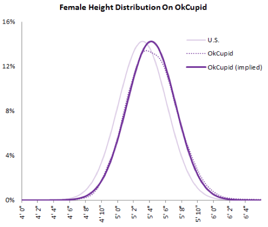
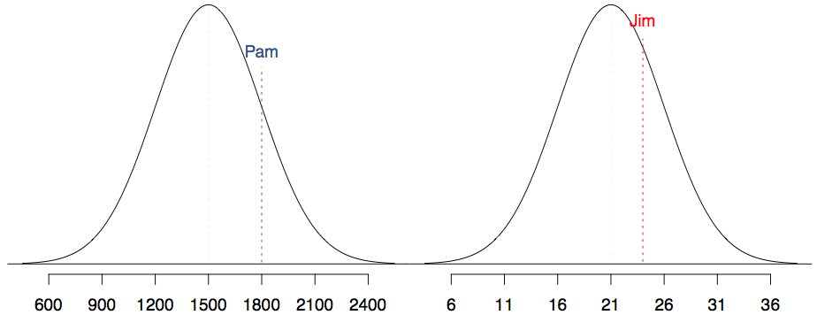
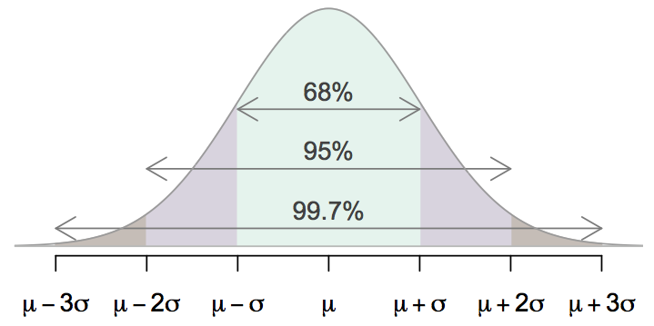

<style>
citation {
  font-size: 4px;
}
</style>

<!--  Version 1.0-0

      This version of the slides is taken directly from Mine Çetinkaya-Rundel's lecture slides
      posted on OpenIntro.org in .pptx and .gdslides format. Simply moved to Rmd. 

      A large part of the HTML/CSS formatting is janky, and could be cleaned up. Feel free to issue a 
      pull request if you love HTML and CSS and want to fix this up.

      This will need quite a bit of tweaking, as it includes all of the
      randomization and simulation material from the other book. I'm tempted
      to leave it in ... it's a better development!

      - wburr, Sep 3, 2018
-->

<!-- This is Chapter 2.1 in the IntroStat text, slides by Mine Cetinkaya-Rundel -->
# Case Study: Gender Discrimination

## Gender Discrimination

* In 1972, as a part of a study on gender discrimination, 48 male bank supervisors were each given the same personnel file and asked to judge whether the person should be promoted to a branch manager job that was described as “routine”.
* The files were identical except that half of the supervisors had files showing the person was male while the other half had files showing the person was female.
* It was randomly determined which supervisors got “male” applications and which got “female” applications.
* Of the 48 files reviewed, 35 were promoted.
* The study is testing whether females are unfairly discriminated against.
* Is this an observational study or an experiment?


<span id="footnote">B.Rosen and T. Jerdee (1974), "Influence of sex role stereotypes on personnel decisions", J.Applied Psychology, 59:9-14.</span>

## Data

At a first glance, does there appear to be a relationship between promotion and gender?

```{r, makeOutcomeTable2_1, echo = FALSE}
library("kableExtra")
library("knitr")
options(knitr.table.format = "html") 
dt <- data.frame("Yes" = c(21, 14, 35), "No" = c(3, 10, 13), "Total" = c(24, 24, 48))
row.names(dt) <- c("Male", "Female", "")
kable(dt, align = 'ccc') %>%
  kable_styling("striped", full_width = FALSE, position = "center", font_size = 20) %>%
  add_header_above(c(" " = 1, "Promoted" = 2, " " = 1)) %>%
  group_rows("Gender", 1, 2) %>%
  group_rows("Total", 3, 3)
```

**% of males promoted**: 21 / 24 = 0.875

**% of females promoted**: 14 / 24 = 0.583

## Practice

We saw a difference of almost 30% (29.2% to be exact) between the proportion of male and female files that are promoted. Based on this information, which of the below is true?

1. If we were to repeat the experiment we will definitely see that more female files get promoted. This was a fluke.
2. Promotion is dependent on gender, males are more likely to be promoted, and hence there is gender discrimination against women in promotion decisions.
3. The difference in the proportions of promoted male and female files is due to chance, this is not evidence of gender discrimination against women in promotion decisions.
4. Women are less qualified than men, and this is why fewer females get promoted.

## Practice

We saw a difference of almost 30% (29.2% to be exact) between the proportion of male and female files that are promoted. Based on this information, which of the below is true?

1. If we were to repeat the experiment we will definitely see that more female files get promoted. This was a fluke.
2. <span id="highlight">Promotion is dependent on gender, males are more likely to be promoted, and hence there is gender discrimination against women in promotion decisions.</span>  <span style="color:red;">Maybe!</span>
3. <span id="highlight">The difference in the proportions of promoted male and female files is due to chance, this is not evidence of gender discrimination against women in promotion decisions.</span>  <span style="color:red;">Maybe!</span>
4. Women are less qualified than men, and this is why fewer females get promoted.

## Two Competing Claims

<div style="font-size:22px;">
“There is nothing going on.” (**Null Hypothesis**)

Promotion and gender are **independent**.

No gender discrimination.

Observed difference in proportions is simply due to chance.

<hr>
<center>**versus**</center>
<hr>

There is something going on.” (**Alternative Hypothesis**)

Promotion and gender are **dependent**.

There is gender discrimination.

Observed difference in proportions is not due to chance.
</div>

## Hypothesis Tests as a Trial
<span style="font-size:22px;">
Hypothesis testing is very much like a court trial.
<div style= "float:right;position: relative; top: -20px;">
```{r, echo=FALSE, out.width = "350px"}
knitr::include_graphics("fig/fig_2_1_trial.png")
```
</div>
<div style="position:relative; bottom:20px;">&nbsp;</div>
* $H_0$: defendent is innocent (English common law; Justinian Codes, UN Declaration of Human Rights), *versus* <br />
 $H_A$: defendent is guilty
* We then present the evidence $-$ collect data
* Then we judge the evidence: "Could these data plausibly have happened by chance if the null hypothesis were true?"
    * If they were very unlikely to have occurred, then the evidence raises more than *a reasonable doubt* in our minds about the null hypothesis
* Ultimately, we must make a decision: how unlikely is **unlikely**?
</span>

<span id="footnote">Image from http://www.nwherald.com/_internal/cimg!0/oo1il4sf8zzaqbboq25oevvbg99wpot</span>

## A Hypothesis Test as a Trial (continued)

* If the evidence is not strong enough to reject the assumption of innocence, the jury returns with a verdict of "not guilty".
    * The jury does not say that the defendant is innocent, just that there is not enough evidence to convict.
    * The defendant may, in fact, be innocent, but the jury has no way of being sure.
* Said statistically, we **fail to reject the null hypothesis**.
    * We never declare the null hypothesis to be true, because we simply do not know whether it's true or not.
    * Therefore we never "accept the null hypothesis".

## A Hypothesis Test as a Trial (continued)

* In a trial, the burden of proof is on the prosecution.
* In a hypothesis test, the burden of proof is on the unusual claim.
*  The null hypothesis is the ordinary state of affairs (the status quo), so it's the alternative hypothesis that we consider unusual and for which we must gather evidence.

## Recap: Hypothesis Testing 
* We start with a **null hypothesis** ($H_0$) that represents the status quo.
* We also have an **alternative hypothesis** ($H_A$) that represents our research question, i.e. what we're testing for.
* We conduct a hypothesis test under the assumption that the null hypothesis is true, either via simulation (today) or theoretical methods (later in the course).
* If the test results suggest that the data do not provide convincing evidence for the alternative hypothesis, we stick with the null hypothesis. If they do, then we reject the null hypothesis in favor of the alternative.

## Simulating the experiment ... 
... under the assumption of independence, i.e., leave things up to chance.

If results from the simulations based on the **chance model** look like the data, then we can determine that the difference between the proportions of promoted files between males and females was simply **due to chance** (promotion and gender are independent).

If the results from the simulations based on the chance model do not look like the data, then we can determine that the difference between the proportions of promoted files between males and females was not due to chance, but **due to an actual effect of gender** (promotion and gender are dependent).

## Application Activity: Simulating the Experiment
<div style="font-size:22px;">
Use a deck of playing cards to simulate this experiment.<br/>

* Let a face card represent **not promoted** and a non-face card represent a **promoted**. Consider aces as face cards.
    * Set aside the jokers.
    * Take out 3 aces $\rightarrow$ there are exactly 13 face cards left in the deck (face cards: A, K, Q, J).
    * Take out a number card $\rightarrow$ there are exactly 35 number (non-face) cards left in the deck (number cards: 2-10).
* Shuffle the cards and deal them intro two groups of size 24, representing males and females. 
* Count and record how many files in each group are promoted (number cards).
* Calculate the proportion of promoted files in each group and take the difference (male - female), and record this value.
* Repeat steps 2 - 4 many times.

</div>

## Step 1
<div style= "float:center; position: relative; top: -20px; left:50px;">
```{r, echo=FALSE, out.width = "900px"}

```
</div>

## Steps 2-4
<div style= "float:center; position: relative; top: -20px; left:100px;">
```{r, echo=FALSE, out.width = "800px"}

```
</div>

## Practice
Do the results of the simulation you just ran provide convincing evidence of gender discrimination against women, i.e. dependence between gender and promotion decisions?

1. No, the data do not provide convincing evidence for the alternative hypothesis, therefore we can't reject the null hypothesis of independence between gender and promotion decisions. The observed difference between the two proportions was due to chance.
2. Yes, the data provide convincing evidence for the alternative hypothesis of gender discrimination against women in promotion decisions. The observed difference between the two proportions was due to a real effect of gender.

## Practice
Do the results of the simulation you just ran provide convincing evidence of gender discrimination against women, i.e. dependence between gender and promotion decisions?

1. No, the data do not provide convincing evidence for the alternative hypothesis, therefore we can't reject the null hypothesis of independence between gender and promotion decisions. The observed difference between the two proportions was due to chance.
2. <span id="highlight">Yes, the data provide convincing evidence for the alternative hypothesis of gender discrimination against women in promotion decisions. The observed difference between the two proportions was due to a real effect of gender.</span>

## Simulations Using Software
<div style="font-size:22px;">
These simulations are tedious and slow to run using the method described earlier. In reality, we use software to generate the simulations. The dot plot below shows the distribution of simulated differences in promotion rates based on 100 simulations.

<div style= "float:center; position: relative; top: -25px; left:150px;">
```{r, echo=FALSE, out.width = "550px"}

```
</div>

*Where is our original result (from the J.Applied Psychology paper) on this graph?*
</div>

## Final statement

Given the simulations, we would expect to see a result as extreme as, or more extreme than, the data of 0.292 approximately 2-in-100 times. Reasonably rare!

Thus, we reject the null hypothesis, and conclude that there is evidence supporting gender discrimination against women in promotion decisions.

<!--------------------------------------------------------------------------

   The material from here to the start of Chapter 2.6 added by Wesley Burr,
   CC-BY license, same as original slides by Mine.
   
-->

# Case Study: Opportunity Cost

## Context
We are interested in whether university student consumers always consider an obvious fact: money not spent now can be spent later. In particular, we are interested in whether reminding students of this fact about money causes them to be thriftier. 

We can summarize the two perspectives as:

* $H_0$: (null hypothesis) Reminding students that they can save money for later purchases will not have any impact on students' spending decisions, versus
* $H_A$: (alternative hypothesis) Reminding students that they can save money for later purchases **will** reduce the chance that they continue with a purchase. 

<span id="footnote">Frederick S., Novemsky, N., Wang, J., Dhar, J. and Nowlis, S. 2009. Opportunity Cost Neglect. Journal of Consumer Research 36: 553-561. </span>

## The Setup

150 students were recruited for the student, and each was given the following statement:<br />

<blockquote>
Imagine that you have been saving some extra money on the side to make some
purchases, and on your most recent visit to the video store you come across a
special sale on a new video. This video is one with your favorite actor or actress,
and your favorite type of movie (such as a comedy, drama, thriller, etc.). This
particular video that you are considering is one you have been thinking about
buying for a long time. It is available for a special sale price of $14.99.

What would you do in this situation? Please circle one of the options below.
</blockquote>

## The Experimental Design

Half of the 150 students were randomized into a control group, and given the following two options:

1. Buy this entertaining video <br />
2. Not buy this entertaining video

The remaining 75 (50%) students were placed in the treatment group, and they saw a slightly modified version (2):

1. Buy this entertaining video. <br />
2. Not buy this entertaining video. Keep the $14.99 for other purchases.

Would the extra statement reminding students of an obvious fact impact the purchasing decision?

## The Study Results

```{r, makeOutcomeTable2_2, echo = FALSE}
library("kableExtra")
library("knitr")
options(knitr.table.format = "html") 
dt <- data.frame("buy" = c(56, 41, 97), "not buy" = c(19, 34, 53), "Total" = c(75, 75, 150))
row.names(dt) <- c("Control", "Treatment", "")
kable(dt, align = 'ccc') %>%
  kable_styling("striped", full_width = FALSE, position = "center", font_size = 20) %>%
  add_header_above(c(" " = 1, "decision" = 2, " " = 1)) %>%
  group_rows("Group", 1, 2) %>%
  group_rows("Total", 3, 3)
```

## Row Proportions

Instead of comparing absolute numbers (15 fewer people choose to buy the DVD in the Treatment group versus the Control group), we can change the results to be **row proportions**:

```{r, makeOutcomeTable2_2b, echo = FALSE}
library("kableExtra")
library("knitr")
options(knitr.table.format = "html") 
dt <- data.frame("buy" = c(0.747, 0.547, 0.647), "not buy" = c(0.253, 0.453, 0.353), "Total" = c(1.00, 1.00, 1.00))
row.names(dt) <- c("Control", "Treatment", "")
kable(dt, align = 'ccc') %>%
  kable_styling("striped", full_width = FALSE, position = "center", font_size = 20) %>%
  add_header_above(c(" " = 1, "decision" = 2, " " = 1)) %>%
  group_rows("Group", 1, 2) %>%
  group_rows("Total", 3, 3)
```
In this case, we have converted each row into a proportion, so that the sum of the decisions adds to $1.00$. 

## Success versus Failure

We will define a **success** (of the experiment, meaning the intervention, or treatment, worked) as being a student who chooses not to buy a DVD. Then, the value of interest is the change in DVD purchase rates that results by reminding students that not spending money now means they can spend the money later.

We construct a **point estimate** for this difference now:

$$
\hat{p}_{\text{trmt}} - \hat{p}_\text{ctrl} = \frac{34}{75} - \frac{19}{75} = 0.453 - 0.252 = 0.200.
$$

Thus, the proportion of students who chose not to buy the DVD was 20% higher in the treatment group than in the control group. Is this result **statistically significant**? 

## Chance and Simulation

* If the null hypothesis ($H_0$) was true, and the treatment had no effect, then the observed difference between the two groups could be attributed entirely to chance
* If the alternative hypothesis ($H_A$) was true, then the difference indicates that reminding students about saving for later purchases impacts their buying decision.

How can we simulate this experiment under the scenario that there is no effect from the treatment?

## Simulation

Start with 150 index cards, representing students.

* Label 53 with "no buy" to represent the 53/150 students who did not choose to buy the DVD
* Label 97 with "buy" to represent the 97/150 who did choose to buy the DVD
* Shuffle the cards
* Sort out 75 into one pile, 75 into another, representing Control and Treatment.

Then any difference between the proportions of the two piles of cards can be attributed entirely to chance. 

## Simulation
<div style="font-size:22px;">
```{r, echo = FALSE}
index_cards <- c( rep("Buy", 97), rep("NoBuy", 53))
control <- sample(x = index_cards, size = 75, replace = FALSE)
print(control)
prop_control <- c(length(which(control == "Buy")), 75 - length(which(control == "Buy")))
```

So our simulation has:

* Control Group (above): `r prop_control[2]` (`r round(prop_control[2]/75, digits = 3)`) "NoBuy"
* Treatment Group (not shown, use process of elimination), `r 53 -prop_control[2]` (`r round(prop_control[2]/75, digits = 3)`) "NoBuy"

This gives a difference of `r round((53-prop_control[2])/75 - prop_control[2]/75, digits = 3)`.
</div>

## Simulation (continued)

<div style="font-size:20px;">
But this is just one experiment! Random chance means one event means nothing -- people often win the lottery, after all, even though there's a chance of only 1 in a million or worse. **Let's do it again!**

```{r, echo = FALSE}
control <- sample(x = index_cards, size = 75, replace = FALSE)
print(control)
prop_control <- c(length(which(control == "Buy")), 75 - length(which(control == "Buy")))
```

* Control Group (above): `r prop_control[2]` (`r round(prop_control[2]/75, digits = 3)`) "NoBuy"
* Treatment Group (not shown, use process of elimination), `r 53 -prop_control[2]` (`r round(prop_control[2]/75, digits = 3)`) "NoBuy"

This gives a difference of `r round((53-prop_control[2])/75 - prop_control[2]/75, digits = 3)`.
</div>

## Simulation (continued)

<div style="font-size:22px;">
We could do this again, and again, and again. Doing it by hand seems incredibly tedious, but computers don't care about the work.

```{r, echo = FALSE}
set.seed(57)
experiments <- vector(length = 1000)
for(j in 1:1000) {
  control <- sample(x = index_cards, size = 75, replace = FALSE)
  experiments[j] <- c(length(which(control == "Buy")), 75 - length(which(control == "Buy")))[2]
  experiments[j] <- round( (53-experiments[j])/75 - experiments[j]/75, digits = 3)
}
print(experiments)
```
</div>

## Stacked Dot Plot

The previous slide had numbers flowing off the screen. There's a better way to show this!

<!-- code from OpportunityCost.R, from ISRS1-source -->

<div style="position:relative; float:left; left:90px; top:-20px;">
```{r, echo = FALSE, out.width = "750px"}
DotPlotRegularized <- function(x,
                               width = 5,
                               col = "#569BBD",
                               cex = 1, ...) {
  x    <- sort(x)
  xu   <- unique(x)
  xlim <- range(x)
  X    <- table(x)
  height <- max(X) / width
  plot(0, 0, xlim = xlim, ylim = c(0, height),
       type = "n", axes = FALSE, ...)
  axis(1)
  
  spread <- min(diff(xu)) / width / 2
  for (i in seq_along(X)) {
    val     <- xu[i]
    num     <- X[i]
    num.rep <- round(num / width) + 1
    pos     <- rep(1:width, num.rep)
    rel.pos <- (pos[1:num] - width / 2) * spread
    ver.pos <- rep(1:num.rep, rep(width, num.rep))
    ver.pos <- ver.pos[1:num]
    points(val + rel.pos, ver.pos, pch = ".",
           col = col, cex = cex)
  }
  abline(h = 0)
}
DotPlotRegularized(experiments, xlab = "Simulated Difference in Proportions", ylab = "", cex = 2)
lines(rep(0.2, 2), c(0, 5), lty = 2, col = "#569BBD")
text(0.2, 5, "observed\ndifference", pos=3)
```
</div>

## Histogram

When we have this many results, we can use **histograms** as a more convenient representation of the data or results.

<div style="float:left; position:relative; top:-20px; left:100px;">
```{r, echo = FALSE}
hist(experiments, freq = TRUE, xlab = "Simulated Difference in Proportions", ylab = "Proportion of simulated scenarios", main = "", breaks = seq(-0.4, 0.4, 0.02), yaxt = 'n')
axis(2, at = seq(0, 200, 20), labels = format(seq(0, 200, 20) / 1000))
lines(c(0.2, 0.2), c(0, 30), lty = 3, lwd = 3)
text(0.2, 30, "observed\ndifference", pos=3)
```
</div>

## Conclusion

So, if there was no treatment effect, we'd only observe a difference of 0.200 or larger less than 1-in-100 times. This is really rare!

So, instead, we will conclude that the data provide strong evidence there is a treatment effect: reminding students before a purchase that they could instead spend the money later on something else **does** reduce their chance of continuing with the purchase. 

Science!

**Note**: for this iteration of the simulation, we'd observe a difference of 0.200 or larger `r length(which(experiments >= 0.200))`-in-1000 times.

# Hypothesis Testing

## Hypothesis Tests
In the last two case studies, we have utilized **hypothesis tests**, a formal technique for evaluating two competing possibilities. Each scenario had:

* A **null hypothesis**, representing skepticism and "no difference"
* An **alternative hypothesis**, representing the possibility that there has been a change, or that there is a treatment effect

Note that the alternative hypothesis does not have to be a single quantity, but can be a **range** of quantities; the null hypothesis, on the other hand, is usually a single quantity or number.

## *p*-values

In the two case studies we examined, we concluded both with a statement giving how often we would expect to see a result like the one given, entirely by chance (2-in-100 for the gender study, 7-in-1000 for the DVD study). This chance is known as a ***p*-value**.

**Formally**: the ***p*-value** is the probability of observing data at least as favourable to the alternative hypothesis as our current data set, if the null hypothesis were true. 

We typically use a summary statistic of the data (like the difference in proportions for the DVD study) to help compute the p-value and evaluate the hypotheses.

## Statistical Significance

When the *p*-value is smaller than a pre-set threshhold, denoted $\alpha$, we say that the results are **statistically significant**. 

* the threshold $\alpha$ is known as the **significance level**
* when the results are statistically significant, the data provide strong evidence against the null hypothesis
* a common level of $\alpha$ is 0.05

## Case Study *p*-values

The specific *p*-values for the two case studies we've examined are:

* Gender Study: $p \approx 0.02$
* DVD Study: $p \approx 0.007$

Later on this course we'll discuss some alternative approaches to computing these *p*-values.

## Decision Errors

We've all read about court cases where a defendent is found guilty, goes to prison, and is later exhonerated (especially through the introduction of DNA evidence). How does this happen?

**Remember**: cases aren't decided on the basis of perfect information. A judge or jury decide guilt or innocence based on the principle of *reasonable doubt*. (Also, the courts and prosecutorial services are flawed: they're staffed with humans, after all!)

So, just like court cases can have errors in their decisions, statistical hypothesis tests can have errors as well.

## Decision Errors (continued)

There are two competing statements in a hypothesis test: the null and the alternative. As the result of a test, we make a decision about which one might be true. There are then four possible cases:

* Null is true, we fail to reject the null (Good)
* Null is true, we reject the null (Bad)
* Alternative is true, we fail to reject the null (Bad)
* Alternative is true, we reject the null (Good)

## Decision Errors (continued)

<center>
```{r, echo=FALSE, out.width = "600px"}

```
</center>

<br />

* Type 1 Error (sometimes listed as Type I): null true, reject anyway. Also known as a **false positive**. 
* Type 2 Error (sometimes listed as Type II): alternative true, fail to reject null. Also known as a **false negative**.

(the positive/negative wording refers to "deciding for the alternative": a positive result decides in favour of the alternative, and a negative result decides that there is no such alternative)

## Decision Errors (continued)

The two types of errors can be a bit tricky to remember. Here's a nice memory aide.

<div style= "float:left;position: relative; top:-20px; left:175px;">
```{r, echo=FALSE, out.width = "500px"}
knitr::include_graphics("fig/fig_2_3_pregnant.jpg")
```
</div>

## Practice

In a court case, the defendent is either innocent ($H_0$) or guilty ($H_A$). What does a Type 1 error represent in such a case?

1. Convicting an innocent person 
2. Convicting a guilty person 
3. Exonerating an innocent person
4. Exonerating a guilty person

## Practice

In a court case, the defendent is either innocent ($H_0$) or guilty ($H_A$). What does a Type 1 error represent in such a case?

1. <span id="highlight">Convicting an innocent person</span>
2. Convicting a guilty person
3. Exonerating an innocent person
4. Exonerating a guilty person

## Improving the Court System

If we wanted to reduce the Type 1 error rate in the court system, what would this entail?

What would this do to the Type 2 error rate?

## Choosing Significance Levels

In our discussion of *p*-values, we mentioned **significance levels**, and that a traditional value used is $\alpha = 0.05$. 

* If making a Type 1 error is dangerous, or especially costly, we should choose a very small significance level
* If, on the other hand, making a Type 2 error is more costly, we should choose a correspondingly larger significance value

In the case of our court system, we err on the side of lowering Type 1: better to allow criminals to walk free of their crimes than to send innocent people to prison for crimes they did not commit. 

What do you think we should do for medical diagnoses: are lower Type 1 or Type 2 errors better?

## Two-Sided Hypotheses

In our two case studies, we actually ignored possibilities in our alternative hypotheses:

* for the gender study, we only asked if **women** were being discriminated against. What if **men** were actually discriminated against?
* for the DVD study, we only asked if the reminder caused students to spend **less**. What if the reminder actually encouraged them to spend **more**?

We actually performed **one-sided hypothesis tests** in these two studies, since we only allowed the alternative to be on one side of the distribution.

## Two-Sided Hypotheses

There are two dangers if we restrict ourselves to one direction, ignoring possibilities that disagree with our data or our worldview:

1. If we frame an alternative hypothesis to match the direction of the data, we generally inflate the Type 1 error. 
2. If we only use alternative hypotheses that agree with our worldview, then we are subjecting ourselves to **confirmation bias**: seeing what we expect! This isn't scientific, and we can do better!

## A Two-Sided Example

CPR is a procedure used on individuals suffering a heart attack when other emergency procedures are unavailable. While this can sometimes help people by providing some blood circulation, done properly it also can cause internal injuries (cracked ribs, etc.). Internal bleeding can cause issues once patients receive care, because a common treatment for clots causing heart attacks is administration of blood thinners.

In this study, we will consider an experiment with patients who underwent CPR for a heart attack, and subsequently were admitted to a hospital, where they were randomly assigned to either receive a blood thinner (treatment group) or not (control group). The outcome variable was 24-hour survival: did the patient live for 24 hours after admission?

<span id="footnote">Böttiger et al. "Efficacy and safety of of thrombolytic therapy after initially unsuccessful cardiopulmonary resuscitation: a prospective clinical trial." The Lancet, 2001: 357(9268), 1583-1585.</span>

## CPR Study
We want to understand whether blood thinners are harmful or helpful. 

$H_0$: blood thinners do not have an overall survival effect, i.e., the survival proportions are the same in each group. $p_t - p_c = 0$. 

$H_A$: blood thinners have an impact on survival, either positive or negative, but not zero. $p_t - p_c \neq 0$. 

## CPR Study: Data

There were 50 patients in the experiment who did not receive a blood thinner (control), and 40 patients who did (treatment). 

```{r, makeOutcomeTable2_3, echo = FALSE}
library("kableExtra")
library("knitr")
options(knitr.table.format = "html") 
dt <- data.frame("Survived" = c(11, 14, 25), "Died" = c(39, 26, 65), "Total" = c(50, 40, 90))
row.names(dt) <- c("Control", "Treatment", "")
kable(dt, align = 'ccc') %>%
  kable_styling("striped", full_width = FALSE, position = "center", font_size = 20) %>%
  group_rows("Group", 1, 2) %>%
  group_rows("Total", 3, 3)
```

## Observed Data

What are $\hat{p}_c$ and $\hat{p}_t$?

* Control: $\hat{p}_c = 11/50 =$
* Treatment: $\hat{p}_t = 14/40 =$

Then the point estimate of the difference in survival proportions for the two groups is:

* Difference: $\hat{p}_t - \hat{p}_c =$

## Simulate!

As in our previous studies, we will simulate what type of differences we might see from chance alone. The population is 25 survivals, 65 deaths, and 90 total patients. 

* randomly assign each patient to control/treatment
* obtain groupings of 50 control patients, 40 treatment patients
* compute $\hat{p}_t - \hat{p}_c$

## First Result

Let a value of 1 be a survival, and a 0 be a death. Then:

```{r}
patients <- c( rep(1, 11), rep(0, 39), rep(1, 14), rep(0, 26) )
experiment <- sample(x = patients, size = 40)
pt <- sum(experiment) / 40     # Add up the '1' cases. These are treatment survivals.
pc <- (25 - sum(experiment))/50   # How many '1' cases are left over? These are controls.
pt - pc
```

## Simulate More

```{r}
set.seed(1)
results <- vector(length = 100000)
for(j in 1:100000) {
  experiment <- sample(x = patients, size = 40)
  results[j] <- sum(experiment) / 40 - (25 - sum(experiment))/50
}
print(results)
```

## Plot the Results
<center>
```{r, echo = FALSE}
hist(results, freq = TRUE, xlab = "Simulated Difference in Proportions", ylab = "Proportion of simulated scenarios", main = "", breaks = seq(-0.44, 0.44, 0.04), yaxt = 'n')
axis(2, at = seq(0, 20000, 1000), labels = format(seq(0, 20000, 1000) / 100000))
lines(c(0.13, 0.13), c(0, 10000), lty = 3, lwd = 3)
text(0.18, 10000, "observed\ndifference", pos=3)
```
</center>

Then, of the 100,000 simulated experiments, `r length(which(results >= 0.1299))` of them (`r length(which(results >= 0.1299))/100000`) gave differences greater-than-or-equal-to the data difference of 0.13.

## *p*-value

The right tail area (the area from the data difference of 0.13 to the far right) is about 0.132. 

* Note that this has nothing to do with the data difference being 0.13: just a coincidence!
* But our alternative hypothesis was not one-sided
* So our actual *p*-value is twice this: 0.13154 $\times$ 2 = 0.263.

For any two-sided test, take the one-sided *p*-value you get from the test statistic's position, and double it. 

## Conclusion

Since our *p*-value was 0.263 (which is quite large), we do **not** have evidence at the 0.05 level to reject the null hypothesis: that is, we do not find statistically significant evidence that the blood thinner administration has any influence on the survival of patients who undergo CPR prior to arriving at the hospital.

## Hypothesis Test Summary

How do we use a hypothesis test in science?

* **Frame the research question**: determine if your research question can be framed as two competing hypotheses, with the null the skeptical view, and the alternative the new/different view.
* **Collect data**: either use an observational study or an experiment, and gather data
* **Analyze the data**: choose an analysis technique appropriate to the data, and identify the *p*-value
* **Form a conclusion**: using the *p*-value, determine whether the data provide statistically significant evidence against the null hypothesis

The rest of the course will largely be concerned with elements of (2) and (3) above: more sophisticated and complicated approaches to dealing with different scientific problems via hypothesis testing.

<!-- Chapter 2.4 from text, slides by Wesley Burr 
  Just including the second study, which introduces a new simulation technique. Also, repeated
  definitions (formally) of parameters and point-nulls. -->
  
# Simulation Case Studies: One Proportion

## Some Definitions

We've mentioned this earlier in the notes, but here we formally define the object used in hypothesis tests.

A **parameter** for a hypothesis test is the "true" (underlying, universal, population) value of interest. We typically estimate a parameter using a point estimate via a **test statistic** from data. 

**Example**: in the CPR study from the last section, we were interested in the probability, $p$, of a patient's survival after being administered blood thinners. 

We typically will denote parameters as Roman letters (e.g., $p$, $q$, $S$) and the point estimates as "hat" versions of the same (e.g., $\hat{p}$, $\hat{q}$, $\hat{S}$).

## Null Values

The **null value**, denoted $p_0$, is the reference value for the parameter under $H_0$. That is, the null hypothesis value of the parameter - in the CPR study, this was $p_0 = 0$. 

## Case Study: Tappers and Listeners

A Stanford University graduate student named Elizabeth Newton conducted an experiment using the "tapper-listener" game, where one person (the "tapper") taps a tune on a desk using their fingers, and
a second person (the "listener") tries to guess what song the person is tapping out. 

In her study, she recruited 120 pairs of tappers-and-listeners. About 50% of her tappers indicated that they expected that the listeners should be able to guess their song. Newton wondered whether 50% was a reasonable expectation.

<span id="footnote">Described in the book *Made to Stick* by Chip and Dan Heath.</span>

## Tappers & Listeners: Hypotheses

Establish two hypotheses:

$H_0$: the tappers are correct, and approximately 50% of the listeners will be able to determine the tune. $p_0 = 0.50$.

$H_A$: the tappers are incorrect, and either more or less than 50% of the listeners will be able to guess the tune. $p_0 \neq 0.50$. 

## Results

In Newton's study, only 3 of the 120 listeners ($\hat{p}=0.025$) were able to guess the song!

From the point of view of the null (skeptical) hypothesis: how likely is this to happen by chance?

## Simulation

How might we simulate this problem? 

To simulate each individual game (tapper-listener pair), we need something that is 50-50 to represent the 50% chance of being one of the listeners who correctly guesses the tune. What do you know that's 50-50?

## Simulation (continued)

Use coin flips! Let H = Heads be a successful guess, and T = Tails be a failed (incorrect) guess.

```{r}
sample(c("H", "T"), size = 1)
```

So in our first simulated game, the listener successfully guessed the song (represented by flipping a coin and achieving Heads). Now, we actually need to expand this single game into a full-fledged experiment. Newton had 120 pairs, so we will simulate 120 coin flips, and that will represent a single experiment. 

```{r}
experiment <- sample(c("H", "T"), size = 120, replace = TRUE)
sum(experiment == "H") / 120
```

## Simulation (continued)

Now, we repeat the experiment 10,000 times to see how likely it might be, by chance, to obtain a result of $\hat{p} = 0.025$.

```{r}
results <- vector(length = 10000)
for(j in 1:10000) {
  experiment <- sample(c("H", "T"), size = 120, replace = TRUE)
  results[j] <- sum(experiment == "H") / 120
}
print(results[1:30])
```

## Plot the Results
<center>
```{r, echo = FALSE}
hist(results, freq = TRUE, xlab = "Simulated Proportions Successful", ylab = "Proportion of simulated scenarios", main = "", breaks = seq(0.0, 0.7, 0.01), yaxt = 'n')
axis(2, at = seq(0, 5000, 100), labels = format(seq(0, 5000, 100) / 10000))
lines(c(0.025, 0.025), c(0, 500), lty = 3, lwd = 3)
text(0.025, 500, "observed\ndifference", pos=3)
```
</center>

Then, of the 10,000 simulated experiments, `r length(which(results <= 0.0251))` of them (`r length(which(results <= 0.0251))/100000`) gave differences less-than-or-equal-to the data difference of 0.025.

## *p*-value

So what is our *p*-value in this case? Less than 1-in-10000! And twice that (doubling, to get the two-tailed *p*-value) is still tiny.

Since we have a *p*-value less than $0.0001$, we have extremely strong evidence for rejecting the null: the proportion of listeners able to determine which song is being tapped is most definitely not $p_0 = 0.50$.

**Note**: in a case like this, even though we have a two-tailed hypothesis test, the *p*-value is so small, and the data result so far out into one (lower) tail, that we can actually acknowledge this, and say that this data provides strong evidence that the chance that a listener will guess the correct tune is **less** than 50%.

<!-- Chapter 2.5 from text, slides by Wesley Burr -->
# The Central Limit Theorem

## Four Case Studies
<center>
```{r, echo=FALSE, out.width = "750px"}

```
</center>

## The Shape

The null distributions observed so far in our case studies all share similar features:

* they are roughly symmetric
* they have a bell-shape

They may not be centered at the same point, or have the same curvature to their bell-shape, but they are otherwise quite similar.

## The Central Limit Theorem for Proportions

If we look at a proportion (or difference in proportions), then under *certain conditions*,
the sample proportion (or difference in proportions) will follow a **bell-shaped curve**
called the *normal distribution*. 

This property is called the **Central Limit Theorem** (or CLT for short).

The conditions required are:

* The observations in the sample are **independent**
* The sample is *large enough*

## Independence

The first condition required for the CLT to apply is **independence**.

To have observations in a sample be independent, we can either take a **random sample** from a population, **or** if we randomly divide individuals into treatment and control groups.

Note how the common feature of these two possibilities is the idea of randomness. 

## Large Enough Samples

The second condition required for the CLT to apply is **large samples**. We need enough observations: the sample size cannot be too small.

Unfortunately, what qualifies as ``small'' changes from one situation to another, and there is no general, universal rule. We will discuss guidelines for specific situations in Chapter 3 later this term.


<!-- This is Chapter 2.6 from the text, Slides by Mine Cetinkaya-Rundel -->
# Normal Distribution

## Obtaining Good Samples
* Unimodal and symmetric, bell shaped curve
* Many variables are nearly normal, but none are exactly normal
* Denoted as $\mathcal{N}(\mu, \sigma) \rightarrow$ Normal with mean $\mu$ and standard deviation $\sigma$

<div style= "float:center; position: relative; top: -25px; left:150px;">
```{r, echo=FALSE, out.width = "550px"}
plot(x = seq(-4, 4, 0.01), y = dnorm(seq(-4, 4, 0.01)), xlab = "", ylab = "", type = "l", yaxt = 'n', xaxt = 'n')
```
</div>

## Heights of Males
<div style= "float:left; position: relative; top:-20px; right:10px;">
```{r, echo=FALSE, out.width = "400px"}
knitr::include_graphics("fig/fig_2_6_okcupid.png")
```
</div>

“The male heights on OkCupid very nearly follow the expected normal distribution -- except the whole thing is shifted to the right of where it should be. Almost universally guys like to add a couple inches.”

“You can also see a more subtle vanity at work: starting at roughly 5'8", the top of the dotted curve tilts even further rightward. This means that guys as they get closer to six feet round up a bit more than usual, stretching for that coveted psychological benchmark.”

<span id="footnote">http://blog.okcupid.com/index.php/the-biggest-lies-in-online-dating</span>

## Heights of Females
<div style= "float:left; position: relative; top:-20px; right:10px;">
```{r, echo=FALSE, out.width = "400px"}

```
</div>
“When we looked into the data for women, we were surprised to see height exaggeration was just as widespread, though without the lurch towards a benchmark height.”

<span id="footnote">http://blog.okcupid.com/index.php/the-biggest-lies-in-online-dating</span>

## Normal distributions with different parameters

<div style= "float:center; position: relative; top:-20px; left:200px;">
```{r, echo=FALSE, out.width = "500px"}
knitr::include_graphics("fig/fig_2_6_mu_sd.png")
```
</div>

***
SAT scores are distributed nearly normally with mean 1500 and standard deviation 300. ACT scores are distributed nearly normally with mean 21 and standard deviation 5. A college admissions officer wants to determine which of the two applicants scored better on their standardized test with respect to the other test takers: Pam, who earned an 1800 on her SAT, or Jim, who scored a 24 on his ACT?

<div style= "float:center; position: relative; top:20px; left:200px;">
```{r, echo=FALSE, out.width = "600px"}

```
</div>

## Standardizing with Z-scores

Since we cannot just compare these two raw scores, we instead compare how many standard deviations beyond the mean each observation is.

* Pam's score is $(1800 - 1500) / 300 = 1$ standard deviation above the mean.
* Jim's score is $(24 - 21) / 5 = 0.6$ standard deviations above the mean.

<div style= "float:center; position: relative; top:20px; left:200px;">
```{r, echo=FALSE, out.width = "550px"}
knitr::include_graphics("fig/fig_2_6_pam_jim2.png")
```
</div>

## Standardizing with Z-scores (continued)

These are called **standardized scores**, or **Z-scores** (or **Z scores**).

* Z score of an observation is the number of standard deviations it falls above or below the mean.
$$
Z = (\text{observation} - \text{mean}) / \text{SD}
$$
* Z scores are defined for distributions of any shape, but only when the distribution is normal can we use Z scores to calculate percentiles.
* Observations that are more than 2 SD away from the mean ($|Z| > 2$) are usually considered unusual.

## Percentiles

* **Percentile** is the percentage of observations that fall below a given data point
* Graphically, percentile is the area below the probability distribution curve to the left of that observation

<div style= "float:center; position: relative; top:20px; left:200px;">
```{r, echo=FALSE, out.width = "550px"}
knitr::include_graphics("fig/fig_2_6_percentile.png")
```
</div>

## Calculating Percentiles using Computation
There are many ways to compute percentiles/areas under the curve.

**R**:
```{r}
pnorm(1800, mean = 1500, sd = 300)
```

**Applets**:
<div style= "float:center; position: relative; top:-20px; left:200px;">
```{r, echo=FALSE, out.width = "500px"}
knitr::include_graphics("fig/fig_2_6_applet.png")
```
</div>

## Calculating Percentiles - Look them Up!

<div style= "float:center; position: relative; top:-20px; left:75px;">
```{r, echo=FALSE, out.width = "850px"}

```
</div>

## Six Sigma
The term six sigma process comes from the notion that if one has six standard deviations between the process mean and the nearest specification limit, as shown in the graph, practically no items will fail to meet specifications.

<div style= "float:center; position: relative; top:10px; left:175px;">
```{r, echo=FALSE, out.width = "350px"}
knitr::include_graphics("fig/fig_2_6_sixsigma.png")
```
</div>

<span id="footnote">http://en.wikipedia.org/wiki/Six_Sigma</span>

## Example: Quality Control

At the Heinz ketchup factory, the amounts which go into bottles of ketchup are supposed to be normally distributed with mean 36 oz. and standard deviation 0.11 oz. Once every 30 minutes a bottle is selected from the production line, and its contents are noted precisely. If the amount of ketchup in the bottle is below 35.8 oz. or above 36.2 oz., then the bottle fails the quality control inspection. What percent of bottles have less than 35.8 ounces of ketchup?

* Let $X$ = amount of ketchup in a bottle: $X \sim \mathcal{N}(\mu = 36, \sigma = 0.11)$

<div style= "float:left; position: relative; top:-10px; right:25px;">
```{r, echo=FALSE, out.width = "350px"}
knitr::include_graphics("fig/fig_2_6_qc.png")
```
</div>
$$
Z = \frac{35.8 - 36}{0.11} = -1.82
$$

## Finding the exact probability - using the $Z$ table
<div style= "float:center; position: relative; top:-20px; left:75px;">
```{r, echo=FALSE, out.width = "850px"}

```
</div>

## Finding the exact probability - using the $Z$ table
<div style= "float:center; position: relative; top:-20px; left:75px;">
```{r, echo=FALSE, out.width = "850px"}

```
</div>

## Finding the exact probability - using R

```{r}
pnorm(-1.82)
```

Simpler!

## Practice

What percentage of bottles **pass** the quality control inspection?

1. 1.82%   &nbsp; &nbsp; &nbsp; 4. 93.12%
2. 3.44%   &nbsp; &nbsp; &nbsp; 5. 95.56%
3. 6.88%

## Practice

What percentage of bottles **pass** the quality control inspection?

1. 1.82%   &nbsp; &nbsp; &nbsp; 4.<span id="highlight"> 93.12%</span>
2. 3.44%   &nbsp; &nbsp; &nbsp; 5. 95.56%
3. 6.88%

<div style="float:left; position:relative; left:100px;">
```{r, echo=FALSE, out.width = "200px"}
knitr::include_graphics("fig/fig_2_6_normal1.png")
```
</div>
<div style="float:left; position:relative; top:-10px; left:100px;">
```{r, echo=FALSE, out.width = "200px"}
knitr::include_graphics("fig/fig_2_6_normal2.png")
```
</div>
<div style="float:left; position:relative; top:-20px; left:120px;">
```{r, echo=FALSE, out.width = "200px"}
knitr::include_graphics("fig/fig_2_6_normal3.png")
```
</div>

<br />

<div style="font-size:18px; top:-50px;">
$$
\begin{split}
Z_{35.8} &= \frac{35.8 - 36}{0.11} = -1.82 \\
Z_{36.2} &= \frac{36.2 - 36}{0.11} = 1.82 \\
P(35.8 < X < 36.2) &= P(-1.82 < Z < 1.82) = 0.9656 - 0.0344 = 0.9312 = 93.12\%
\end{split}
$$
</div>

## Example: Finding Cutoff Points
Body temperatures of healthy humans are distributed nearly normally with mean 98.2$^\circ$F and standard deviation 0.73$^\circ$F. What is the cutoff for the lowest 3% of human body temperatures?

<div style="float:left; position:relative; top:-20px; left:50px;">
```{r, echo=FALSE, out.width = "250px"}
knitr::include_graphics("fig/fig_2_6_normal4.png")
```
</div>
<div style="float:left; position:relative; top:-20px; left:100px;">
```{r, echo=FALSE, out.width = "400px"}
knitr::include_graphics("fig/fig_2_6_zoom_table.png")
```
</div>

<br />

<div style="font-size:18px; top:-50px;">
$$
\begin{split}
P(X < x) &= 0.03 \longrightarrow P(Z < -1.88) = 0.03 \\
Z &= \frac{\text{obs} - \text{mean}}{\text{SD}} \longrightarrow \frac{x - 98.2}{0.73} = -1.88 \\
x &= (-1.88 \times 0.73) + 98.2 = 96.8^\circ\text{F}
\end{split}
$$
</div>

<span id="footnote">Mackowiak, Wasserman, and Levine (1992), A Critical Appraisal of 98.6 Degrees F, the Upper Limit of the Normal Body Temperature, and Other Legacies of Carl Reinhold August Wunderlick.</span>

## Practice

Body temperatures of healthy humans are distributed nearly normally with mean 98.2$^\circ$F and standard deviation 0.73$^\circ$F. What is the cutoff for the highest 10% of human body temperatures?

1. 97.3$^\circ$F &nbsp; &nbsp; &nbsp; 3. 99.4$^\circ$F
2. 99.1$^\circ$F &nbsp; &nbsp; &nbsp; 4. 99.6$^\circ$F

## Practice
Body temperatures of healthy humans are distributed nearly normally with mean 98.2$^\circ$F and standard deviation 0.73$^\circ$F. What is the cutoff for the highest 10% of human body temperatures?

1. 97.3$^\circ$F &nbsp; &nbsp; &nbsp; 3. 99.4$^\circ$F
2. <span id="highlight">99.1$^\circ$F</span> &nbsp; &nbsp; &nbsp; 4. 99.6$^\circ$F

<div style="float:left; position:relative; top:-20px; left:50px;">
```{r, echo=FALSE, out.width = "250px"}
knitr::include_graphics("fig/fig_2_6_normal_practice.png")
```
</div>
<div style="float:left; position:relative; top:-20px; left:100px; ">
```{r, echo=FALSE, out.width = "400px"}

```
</div>

<div style="font-size:18px; ">
$$
\begin{split}
P(X > x) &= 0.10 \longrightarrow P(Z > 1.28) = 0.10 \\
Z &= \frac{\text{obs} - \text{mean}}{\text{SD}} \longrightarrow \frac{x - 98.2}{0.73} = 1.28 \\
x &= (1.28 \times 0.73) + 98.2 = 99.1^\circ\text{F}
\end{split}
$$
</div>

## 68-95-99.7 Rule

For normally distributed data,

* about 68% falls within 1 SD of the mean
* about 95% falls within 2 SD of the mean
* about 99.7% falls within 3 SD of the mean

It is possible for observations to fall 4, 5 or even more standard deviations away from the mean, but these occurrences are very rare if the data are nearly normal.

<div style="float:left; position:relative; top:-20px; left:250px;">
```{r, echo=FALSE, out.width = "400px"}

```
</div>

## Describing variability using the 68-95-99.7 Rule

<div style="font-size:22px;">
SAT scores are distributed nearly normally, with mean 1500 and standard deviation 300. 

* $\approx$ 68% of students score between 1200 and 1800 on the SAT
* $\approx$ 95% of students score between 900 and 2100 on the SAT
* $\approx$ 99.7% of students score between 600 and 2400 on the SAT
</div>

<div style="float:left; position:relative; top:-10px; left:250px;">
```{r, echo=FALSE, out.width = "375px"}
knitr::include_graphics("fig/fig_2_6_sd_rule_specific.png")
```
</div>

<span id="footnote">Note that it is not possible to achieve more than 2400 points on the SAT. In 2015, 1.7 million students took the SAT, with an average score of 1490 and less than 8500 students scoring higher than 2280.</span>

## Example: Number of nights of sleep on school nights

<div style="float:left; position:relative; top:-10px; left:200px;">
```{r, echo=FALSE, out.width = "500px"}

```
</div>

## Example: Number of nights of sleep on school nights

<div style="width:100%; float:left; position:relative; top:-10px; left:200px;">
```{r, echo=FALSE, out.width = "500px"}
knitr::include_graphics("fig/fig_2_6_hist2.png")
```
</div>

<div style="font-size:22px;">
Mean = 6.88 hours, SD = 0.92 hours.  <br />
72% of the data are within 1 SD of the mean: 6.88 $\pm$ 0.93.
</div>

## Example: Number of nights of sleep on school nights

<div style="width:100%; float:left; position:relative; top:-10px; left:200px;">
```{r, echo=FALSE, out.width = "500px"}
knitr::include_graphics("fig/fig_2_6_hist3.png")
```
</div>

<div style="font-size:22px;">
Mean = 6.88 hours, SD = 0.92 hours. <br />
72% of the data are within 1 SD of the mean: 6.88 $\pm$ 0.93.<br />
92% of the data are within 2 SD of the mean: 6.88 $\pm$ 2 $\times$ 0.93.
</div>

## Example: Number of nights of sleep on school nights

<div style="width:100%; float:left; position:relative; top:-10px; left:200px;">
```{r, echo=FALSE, out.width = "500px"}

```
</div>

<div style="font-size:22px;">
Mean = 6.88 hours, SD = 0.92 hours. <br />
72% of the data are within 1 SD of the mean: 6.88 $\pm$ 0.93.<br />
92% of the data are within 2 SD of the mean: 6.88 $\pm$ 2 $\times$ 0.93. <br />
99% of the data are within 3 SD of the mean: 6.88 $\pm$ 3 $\times$ 0.93. 
</div>

## Practice

Which of the following is **false**?

1. Majority of Z scores in a right skewed distribution are negative.
2. In a skewed distributions the Z score of the mean might be different than 0.
3. For a normal distribution, IQR is less than 2 x SD.
4. Z scores are helpful for determining how unusual a data point is compared to the rest of the data in the distribution.

## Practice

Which of the following is **false**?

1. Majority of Z scores in a right skewed distribution are negative.
2. In a skewed distributions the Z score of the mean might be different than 0.
3. <span id="highlight">For a normal distribution, the IQR is less than 2 x SD.</span>
4. Z scores are helpful for determining how unusual a data point is compared to the rest of the data in the distribution.

<!-- Written by Wesley Burr, based on the development of 2.7 in Diez, Barr and Cetinkaya-Rundel, but 
using the CPR example instead of the two in the book -->

# Applying the Normal Model

## Revisiting the Tapping Example

Recall the Tapping example. 

<center>
```{r, echo = FALSE, out.width = "800px"}
results <- vector(length = 100000)
for(j in 1:100000) {
  experiment <- sample(c("H", "T"), size = 120, replace = TRUE)
  results[j] <- sum(experiment == "H") / 120
}
hist(results, freq = TRUE, xlab = "Simulated Proportions Successful", 
     ylab = "Proportion of simulated scenarios", main = "", breaks = seq(0.25, 0.725, 0.025), yaxt = 'n')
axis(2, at = seq(0, 50000, 1000), labels = format(seq(0, 50000, 1000) / 100000))
``` 
</center>

## Standard Error

Point estimates vary from sample to sample, and we quantify this variability with the **standard error**. This is equivalent to the standard deviation associated with the estimator. The way we actually determine the standard error changes based on the situation: this makes it a little complicated!

However, there is one commonality in most of the situations we will examine in this course: we can use the **Central Limit Theorem** to determine the standard error.

## Normal Model Application

The data we obtained in the Tapping experiment fits closely to a normal distribution, with mean $\mu = 60$ and standard deviation $5.4772$ (these numbers come from a formula we will discuss later in Chapter 3). When you scale these numbers to the proportional chart we showed two slides up, they become

* Mean proportion of simulations successful: $0.5$
* Standard deviation of simulations successful: $0.0456$.

We use this standard deviation as the **standard error**.

## Normal Model Application (continued)

<center>
```{r, echo = FALSE, fig.cap = "Null distribution of proportion of successes with an overlaid normal curve."}
h <- hist(results, breaks = seq(0.25, 0.725, 0.025), plot = FALSE)
plot(h$mids, h$density, type = "h", lwd = 4, lend = 1, yaxt = 'n', xlab = "Simulated proportions successful",
     ylab = "")
x <- seq(0.2, 0.8, 0.001)
lines(x = x, y = dnorm(x, mean = 0.5, sd = 0.04564), col = "blue", lwd = 2)
```
</center>

## Using the Normal Approximation

Examining the figure on the last slide, it appears clear that the simulations and the normal approximation are very close. So we can use the normal density shown **as** an approximation for finding *p*-values.

Our observed success rate was 3/120, or $p = 0.025$. 

$$
Z = \frac{\hat{p} - p_0}{\text{SE}} = {0.025 - 0.5}{0.0456} = -10.417
$$

We could look this up in a table, or use statistical software.

## Looking it up in a table

Tables of $Z$ values aren't an immediate help here, because they only go as high/low as $\pm 3.9$. 

<center>
```{r, echo=FALSE, out.width = "650px"}

```
</center>

<br />
So the table says that our two-tailed *p*-value is <0.0004.

## Using a computer

```{r}
pnorm(-10.41667) * 2
```

This is a really, really small number!

Either way, whether *p* $< 0.004$, or *p* = $-2.08\times 10^{-25}$, we **do have evidence** to reject the null hypothesis, and conclude that the proportion of tapping listeners who correctly identify a song is greater or smaller than 0.50.

(In our original permutation simulation, we found that *p* $< 1/1000 = 0.001 -- same conclusion!)

## Textbook Example (medical consultant)

There is an additional example in 2.7.3, where this normal approximation fails! Remember that the normal approximation has two requirements:

* the observations in the sample must be independent
* the sample must be sufficiently large

When one or both of these fail, the normal **approximation** is not a **good** approximation, and the results won't match up! In Chapter 3 we'll talk about ways to detect this.

# Confidence Intervals 

## Confidence Intervals (CIs)
Point estimates (like the 3-in-120 tapping-listeners who correctly identified the song) provide a single *plausible* value for a parameter.

However, point estimates are almost never perfect! 

A logical step is providing a *plausible range* of values for the parameter. This is called a **confidence interval** (or CI).

## Reporting

If we just report a point estimate, we will almost certainly not "hit" the true parameter value that exists. This is like fishing in a murky lake with only a spear: even if you aim the spear where you think you saw a fish, you'll probably miss!

If we report a confidence interval (range of values), we have a much better chance of hitting the true parameter value. This is like fishing in the same murky lake, but with a net!

## Constructing a Confidence Interval

Confidence intervals are given percentages

* 95% confidence interval
* 80% confidence interval
* 99% confidence interval

The standard error (which measures the uncertainty of the point estimate) provides a guide for how large to make the confidence interval.

## Construction a Confidence Interval (ctd)

When the sampling (null) distribution of a point estimate can reasonably be modeled as normal, the point estimate we observe will be within 1.96 standard errors of the true value of interest about 95% of the time.

Thus, a **95% confidence interval** for such a point estimate can be constructed as:

<center>
$\text{point estimate} \pm 1.96 \times \text{SE}$
</center>

We say that we are *95% confident that this interval captures the true (population) value*. 

## Practice

Given the situation with the DVD and opportunity cost, we have a mean difference of 0.20, with a SE of 0.078. Construct a 95% confidence interval.

## Actual Performance

Once we have a confidence interval, how often (in practice) will it actually capture the true (population parameter)?

The confidence level!

So if we were to do 20 different experiments, and compute 20 different estimates, and 20 different confidence intervals, it would be entirely reasonable for 1 of those 20 (5%) to completely fail to capture the population parameter value.

**But it's probability ... ** so you can't predict when this is going to happen. It might happen to you 5 times today, and then not again for a week. 

## Interpretation

As on the last slide: we interpret confidence intervals as ...

*We are N% confident that the population parameter is between ...*

We do not try to talk about capturing the population parameter with a certain probability -- while you can think of the confidence interval as a probability, it only really quantifies how plausible it is that the parameter is in the interval. 

## Confidence Intervals for Any Confidence Level

If the point estimate follows the normal model with standard error SE, then a confidence interval for the population parameter is 
<center>
$$
\text{point estimate} \pm z^* × \text{SE}
$$
</center>
where $z^*$ corresponds to the confidence level selected.

We select $z^*$ so that the area between $-z^*$ and $z^*$ in the normal model corresponds to the confidence level. 

## Example of Two Confidence Levels

<center>
```{r, echo=FALSE, out.width = "850px"}

```
</center>

## Finding $z^*$ using R

```{r}
c( qnorm(0.025), qnorm(0.975), qnorm(0.005), qnorm(0.995) )
```

The **qnorm()** function returns the $z^*$ that corresponds to an area to the **left** as given. 

What would **qnorm(0.5)** be?

## Margin of Error

We often use $z^* \times \text{SE}$ in our formulae: often enough that we give it a special name.

The **margin of error** is the quantity $z^* \times \text{SE}$, and is often shortened to **ME**.
